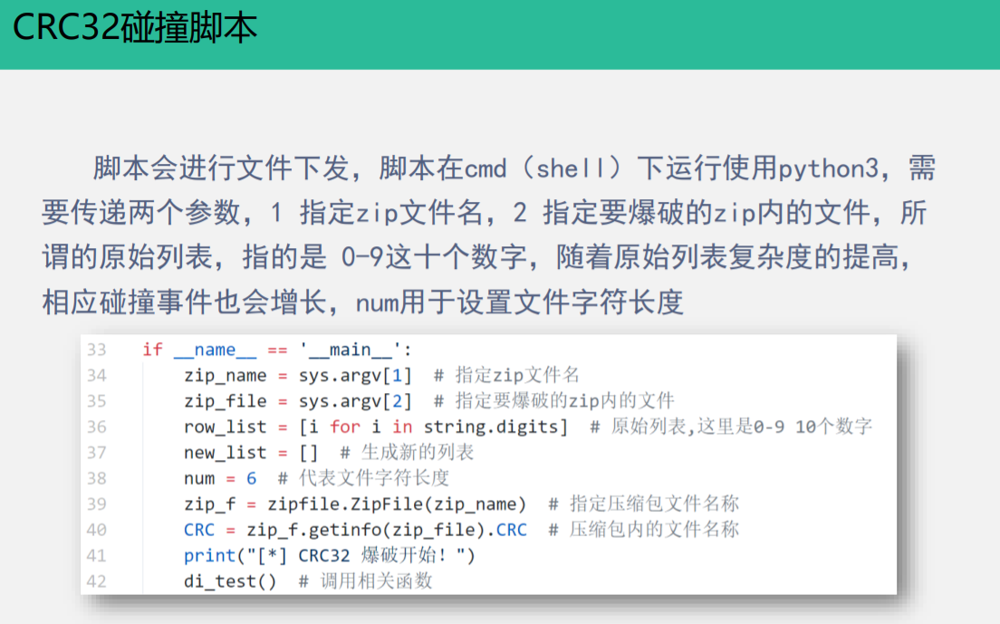
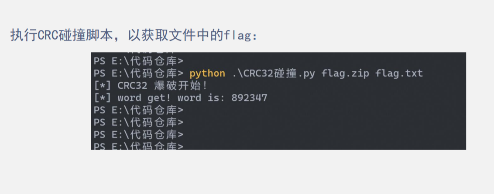

## 压缩源文件目录区：
```
50 4B 01 02：目录中文件文件头标记
1F 00：压缩使用的 pkware版本     zip(全局方式标记，有无加密，奇数为加密，偶数不加密)
14 00：解压文件所需的pkware版本
00 00：全局方式标记，有无加密，奇数为加密，偶数不加密
08 00：压缩方式
64 97：最后修改文件时间
38 4F：最后修改文件日期
41 E5 65 98：CRC32校验
```
## 压缩源文件目录结束标志：
```
50 4B 05 06：目录结束标记
00 00：当前磁盘编号
00 00：目录区开始磁盘编号
08 00：压缩方式
```
> 全局方式位标记的四个数字中只有第二个数字对其有影响，其它的不管为何值，都不影响它的加密属性！ 
>> 第二个数字为奇数时 –>加密 (01 00)

>> 第二个数字为偶数时 –>未加密 (02 00)

## CRC32碰撞
CRC32，即冗余校验码，在Zip文件中，CRC32会产生一个32位（4个字节）的校验值。

产生CRC32时，源数据每一位都参与了运算，因此，不同的数据，会导致不同的CRC32值，利用这个原理，就可以进行CRC32碰撞，进位直接爆破出压缩包内加密文件内容。


