# web
1. 打开题目，根据提示得到页面

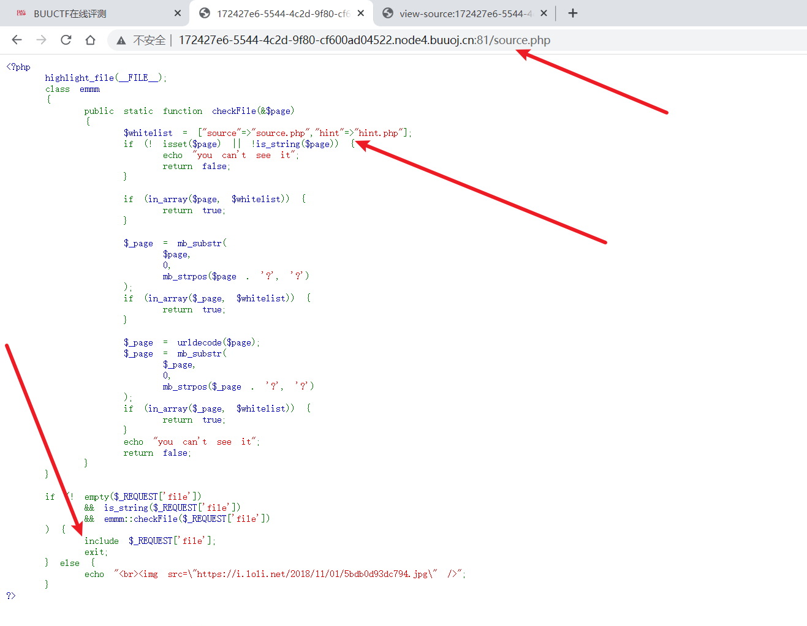

可以得知有白名单，文件包含，传参方式为get，那么我们再访问另一个网页

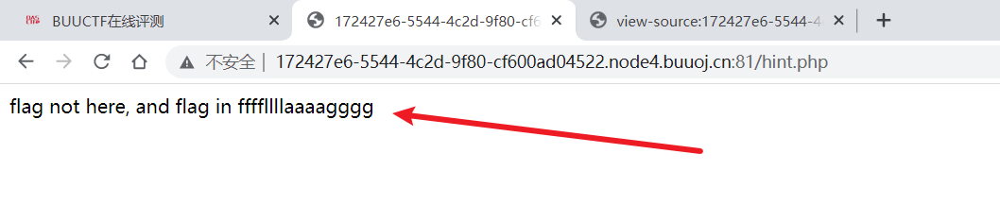

得到另外一个提示，flag在这里，那我们尝试包含一下白名单内的文件

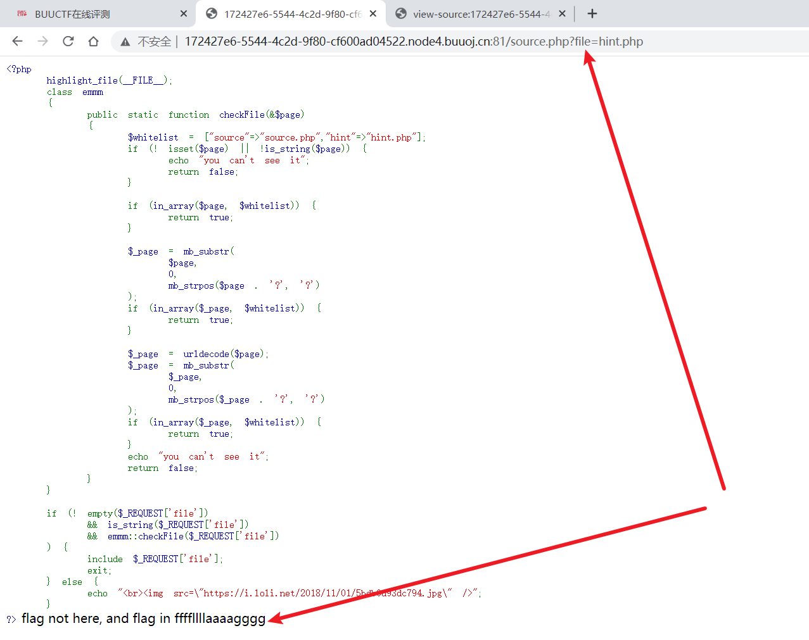

包含成功，那我们尝试绕过白名单包含/etc/passwd

包含成功，那么接着开始包含flag

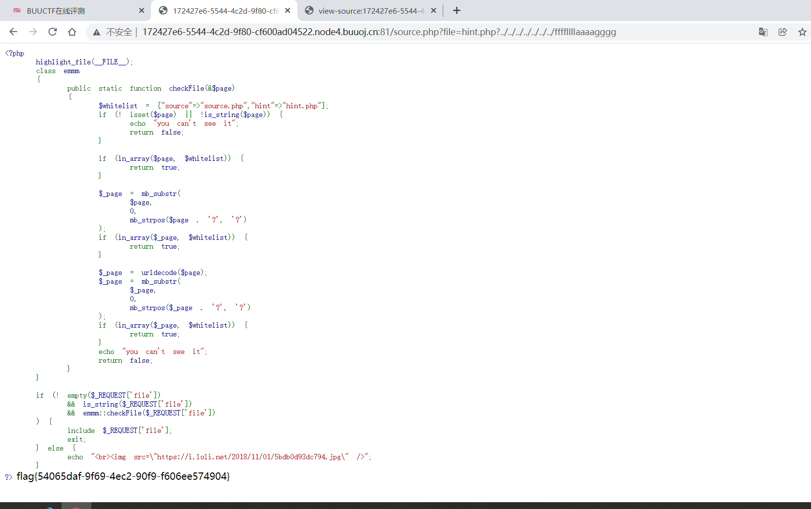

成功得到flag，考点代码审计，文件包含白名单绕过，目录穿越

2. 
太简单了，没啥好说的就当玩玩。。

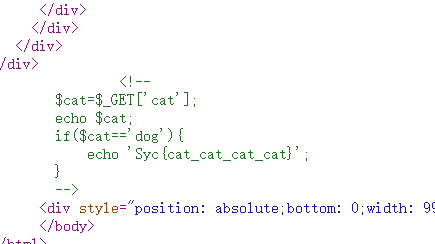

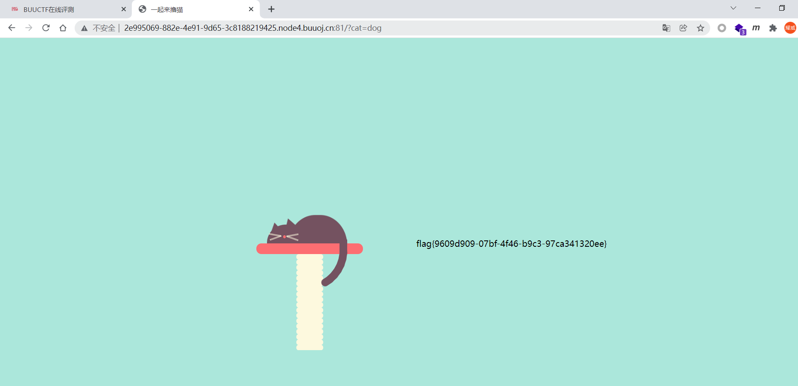

3. 
打开题目，根据提示进入tip，发现包含了flag.php

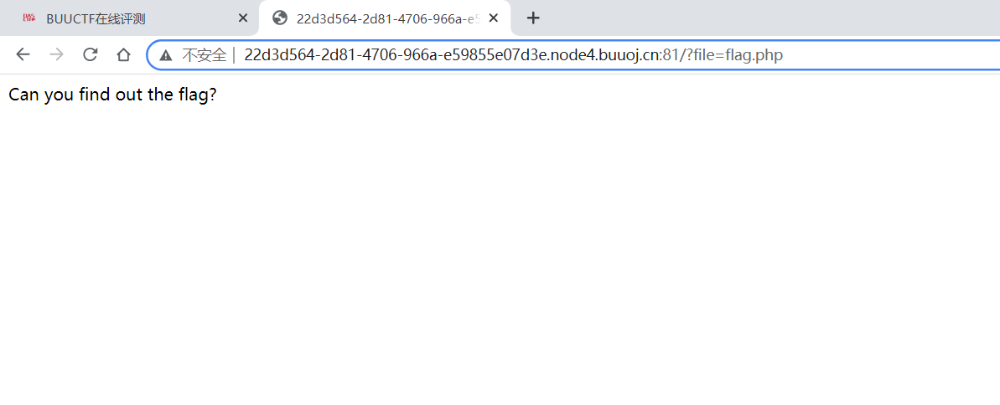

那么尝试php伪协议查看源码

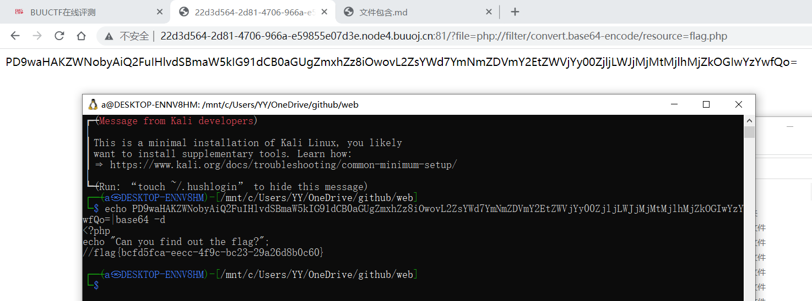

成功获取flag，考点文件包含伪协议的利用

4. 

打开题目，根据题意发现是命令注入，过滤了空格，那我们可以用$IFS$9来进行绕过

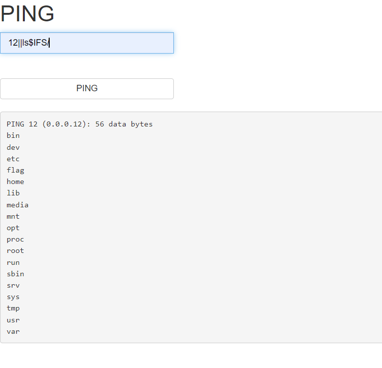

在根目录下发现flag，尝试对flag进行读取

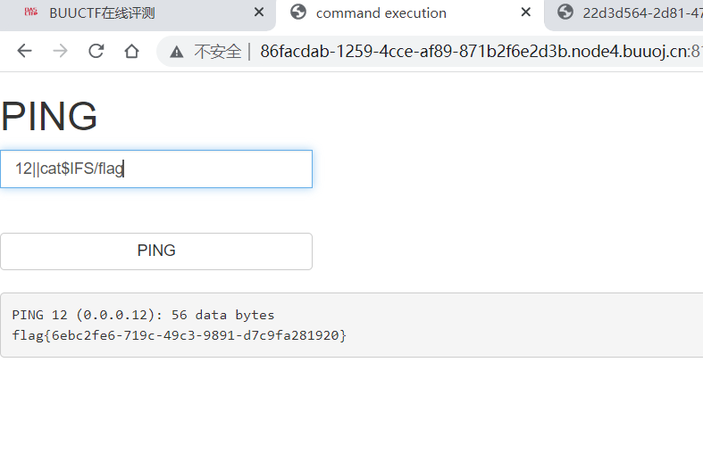

成功读取到flag，本题考点命令注入的空格绕过
# misc
1. 
打开是一张图片，十六进制编辑查看发现文件头是jeif，，，本以为改个后缀可以直接打开最后发现flag藏在了文件尾

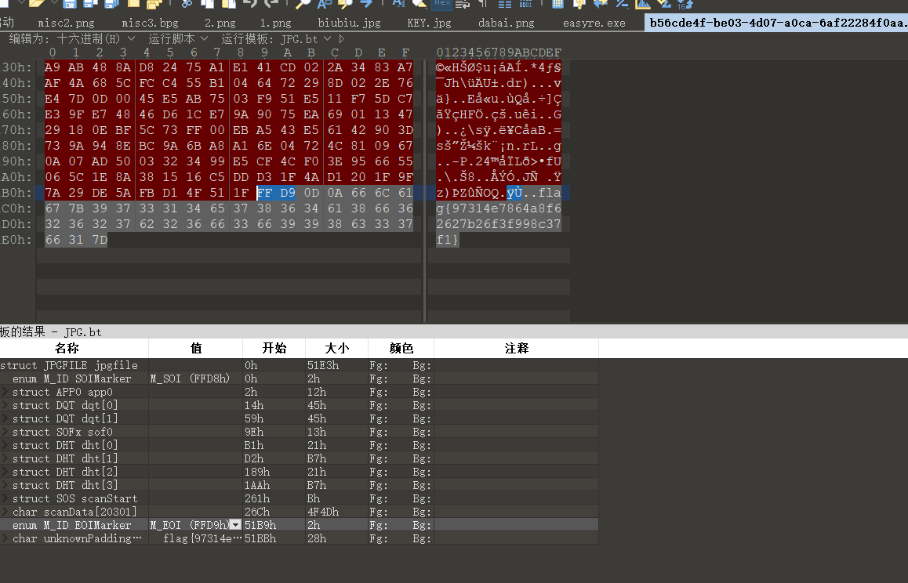

2. 
下载后依然是一张图片，查看十六进制没有结果，文件头对应的文件格式也是正确的，最终发现flag藏在了属性里面，越来越离谱

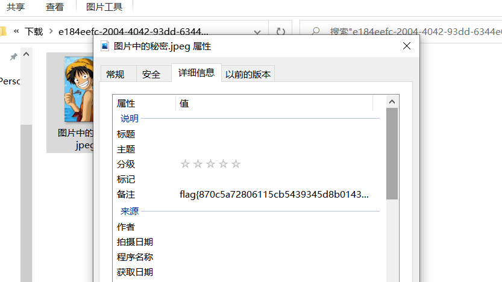

3. 

打开图片，未找到有用的信息，lsb打开发现rgb通道分别有一排狗啃的一样的东西

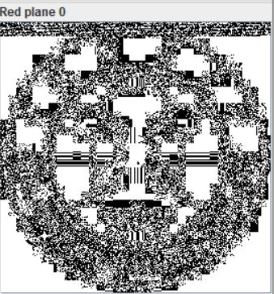
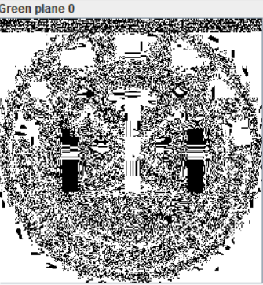
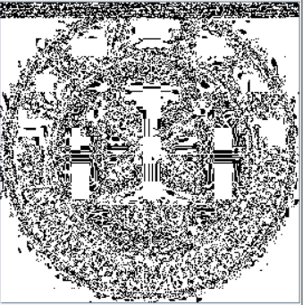

保存为图片

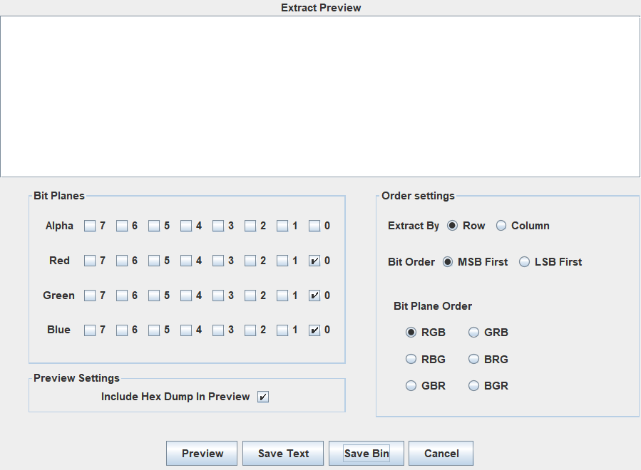

发现是一张二维码，最终解得flag

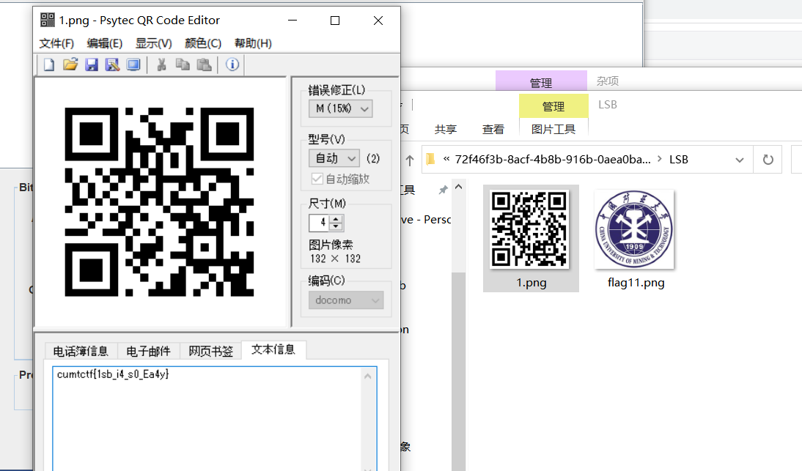

4. 
流量分析，根据题意查找登录网页，最终发现

5. 
下载后是一个压缩包，解压需要密码，查看压缩包十六进制文件发现是伪加密，将其更改

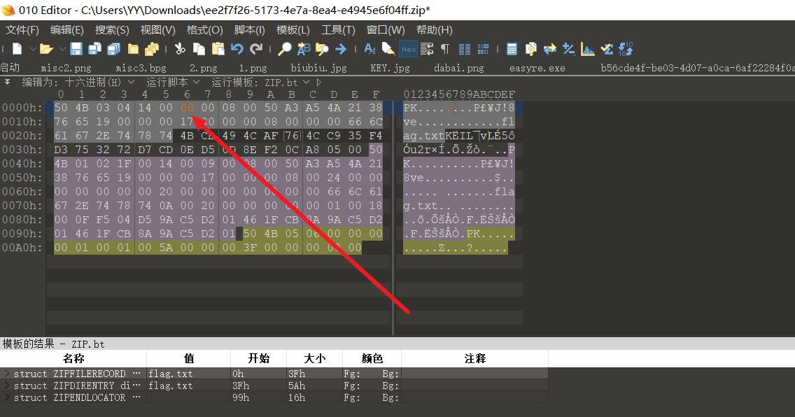

再次解压，成功解压并且获得flag

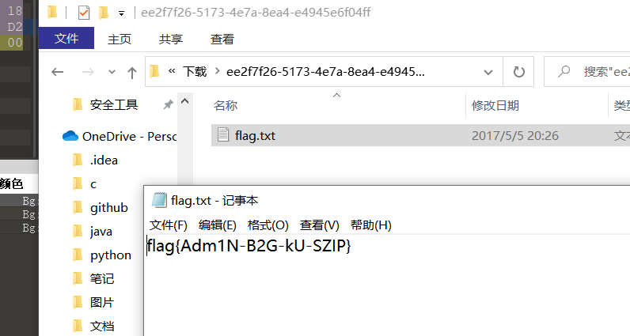
# re
1. 
天天看源码就能有结果。。。

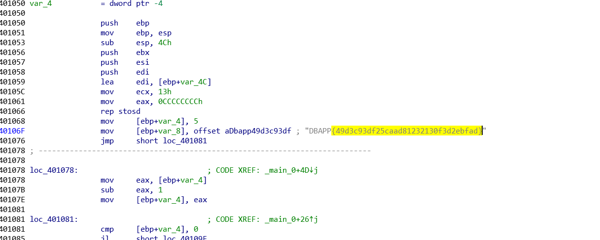

2. 
查看壳，upx

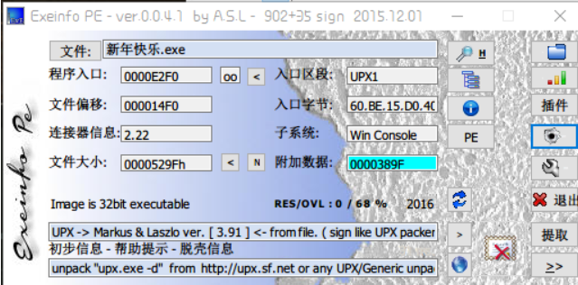

脱壳

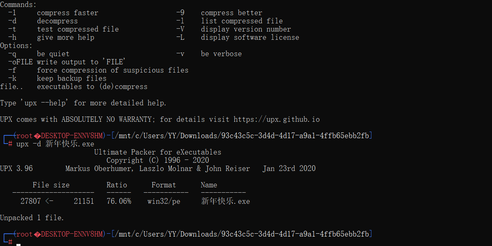

分析，直接得到flag

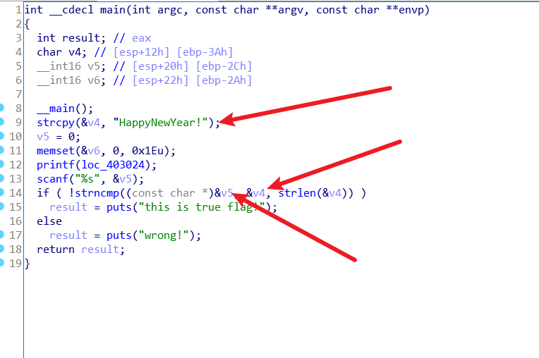