# web
1. 
拿到网页发现直接给出了一句话木马，但是不知道为什么直接post发送数据没有回显，只能使用工具拿到flag

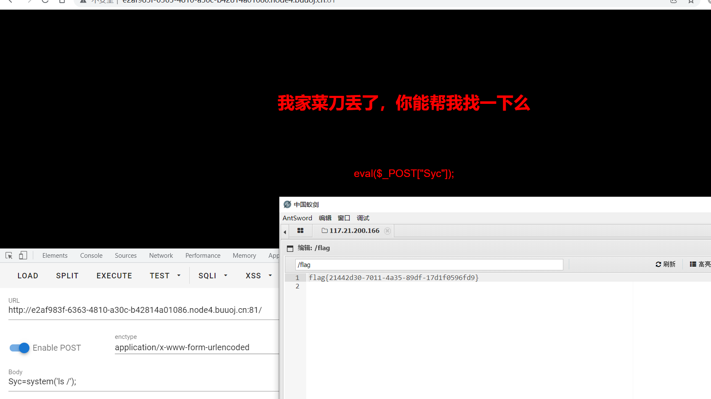

2. 
打开发现一个正常的网站，没有任何线索，然后源码里面发现一个网站，打开进入发现线索

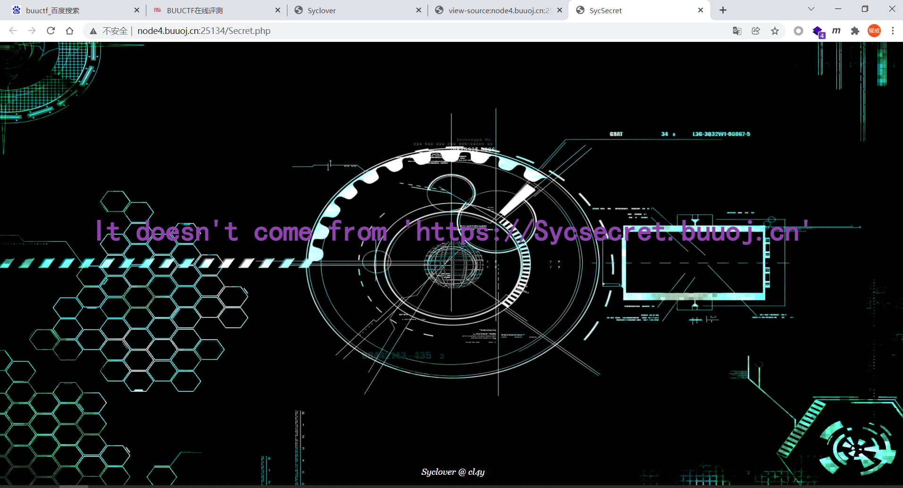

伪造http头，Referer

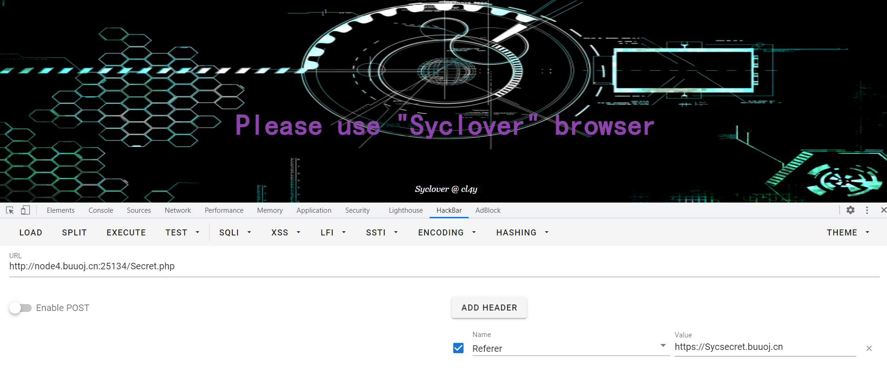

继续伪造ua

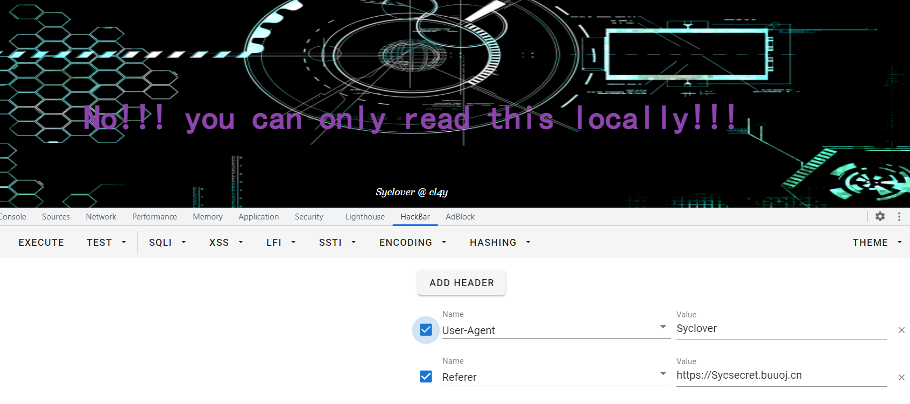

继续伪造本地

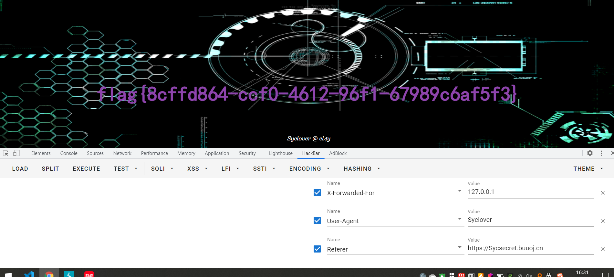

得到flag

3. 
打开题目，发现提示网站有备份的习惯，那么目录扫描，发现www.zip,下载后查看发现flag

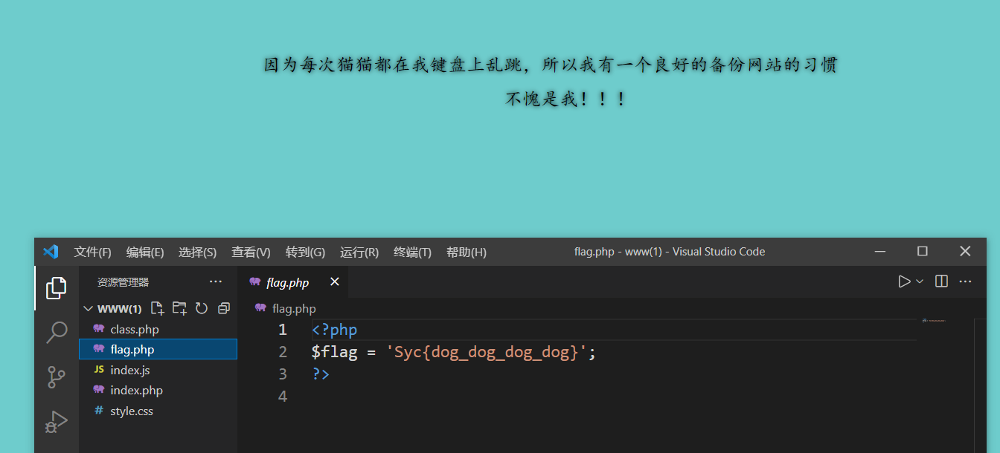

4. 
根据题目提示，备份文件，尝试扫描器扫描，无法成功，手动测试，发现index.php.bak可以下载，代码审计

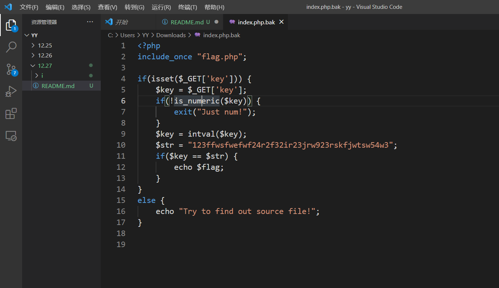

很明显php弱比较，只比较前三位，很简单绕过

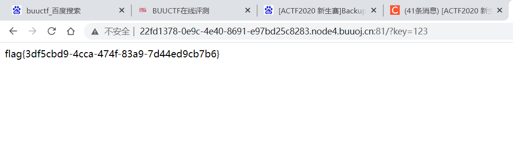
# misc
1. 
发现是一张图片，十六进制未找到线索，打开lsb，发现rgb0通道均有痕迹

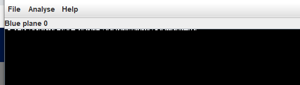

进入查看，发现flag

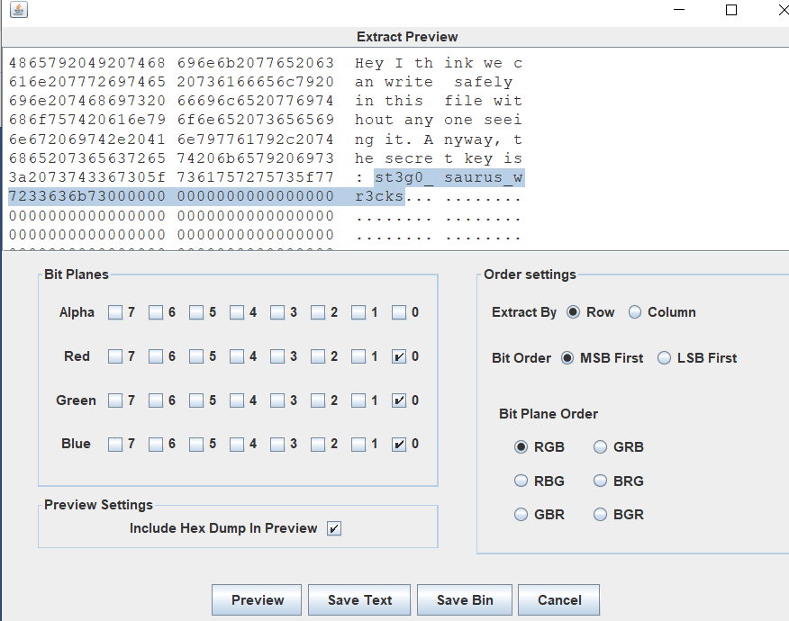

2. 

下载到图片，lsb，属性，十六进制均未找到线索，binwalk分析发现藏有rar压缩包

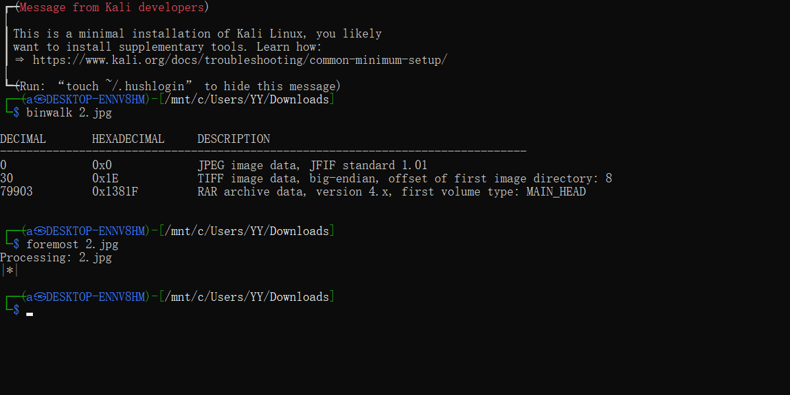

分离出来，需要密码，使用暴力破解

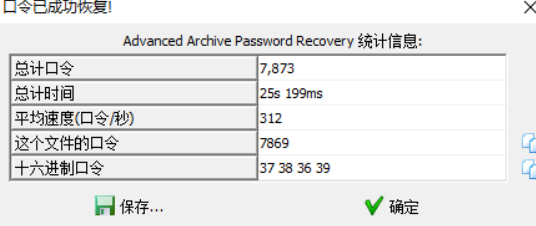

最终得到flag

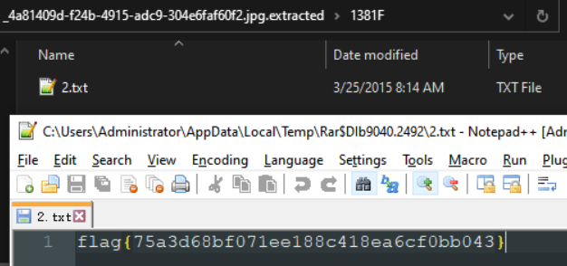

3. 

lsb与属性未找到线索，binwalk发现藏了个压缩包，分离

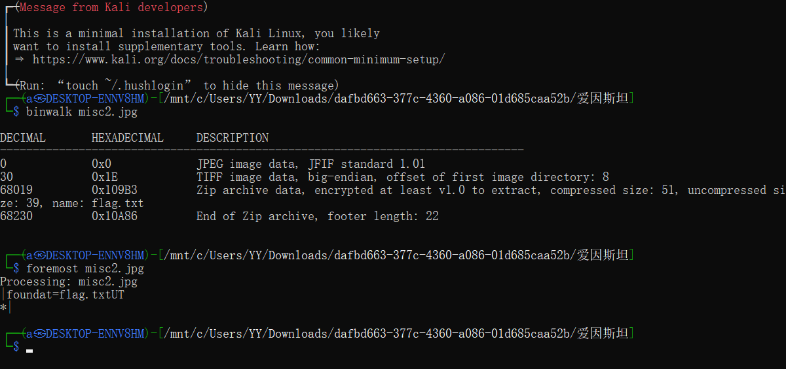

压缩包需要密码，查看图片发现线索

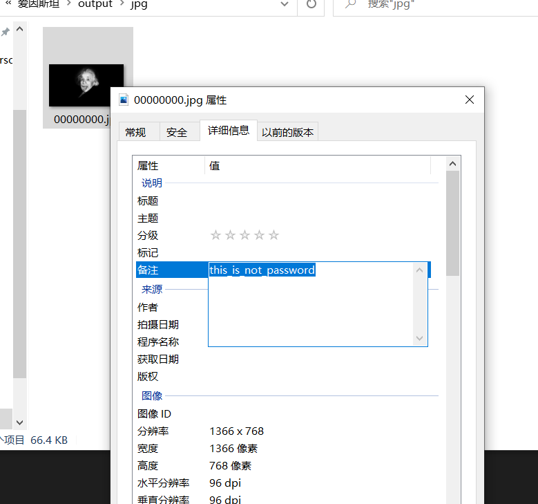

进行解压缩，得到flag

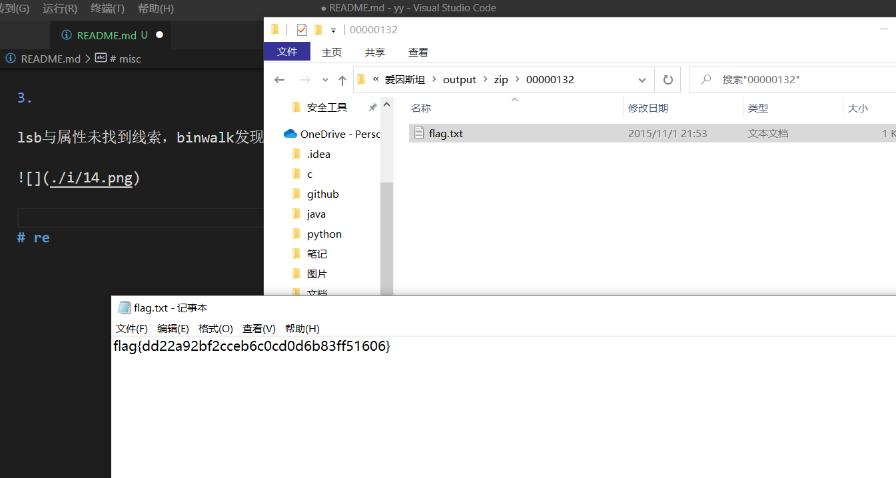

4. 
怎么又来了个直接出flag的了

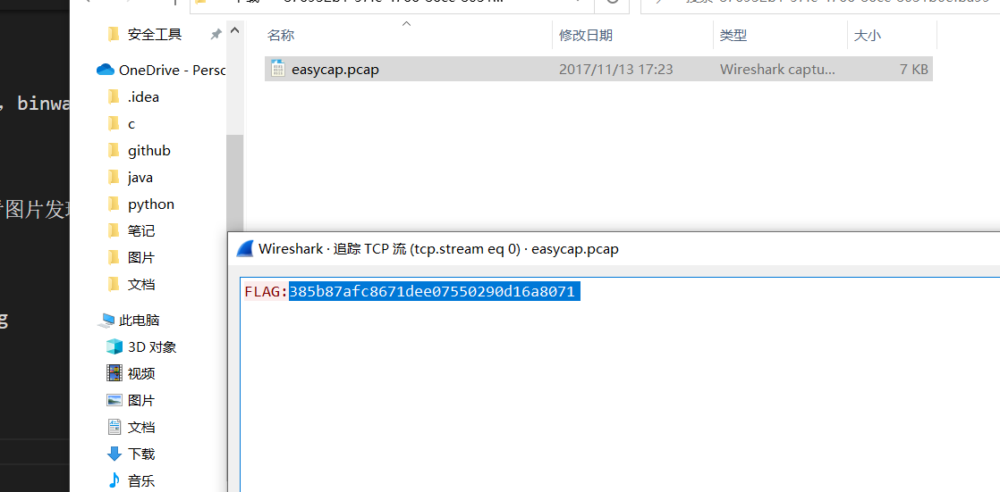

5. 

藏得真够深的。。。

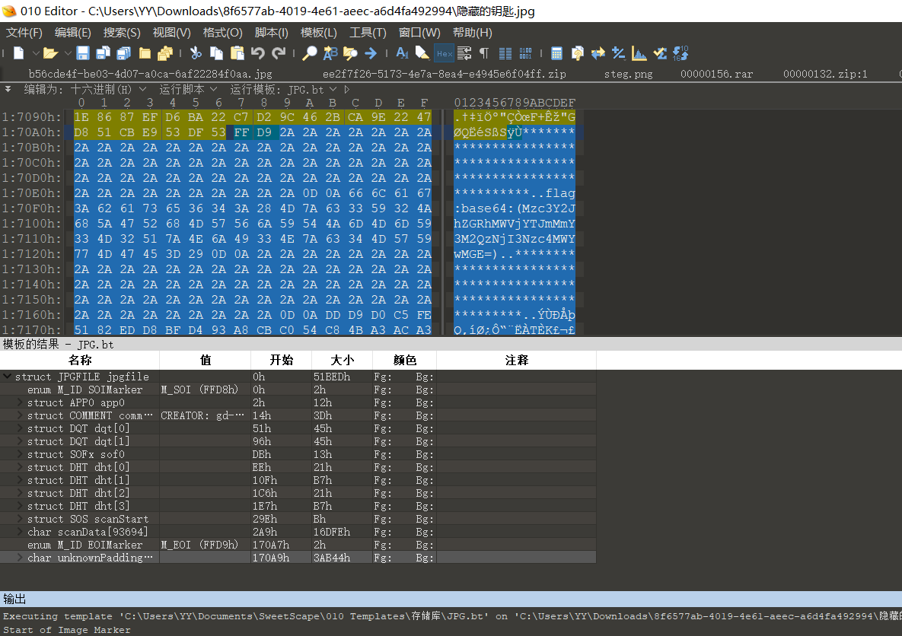

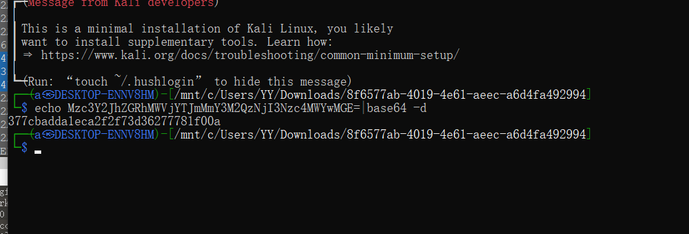
# re