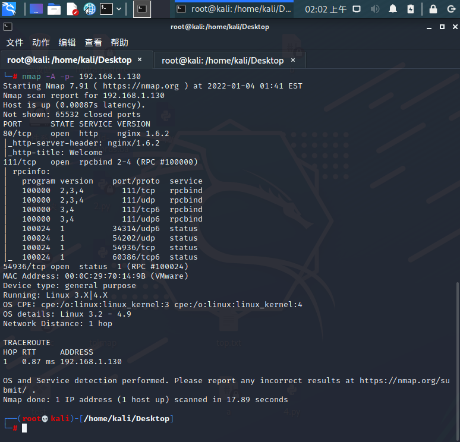
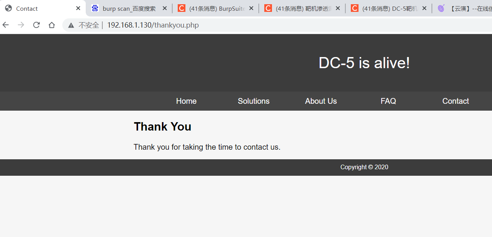
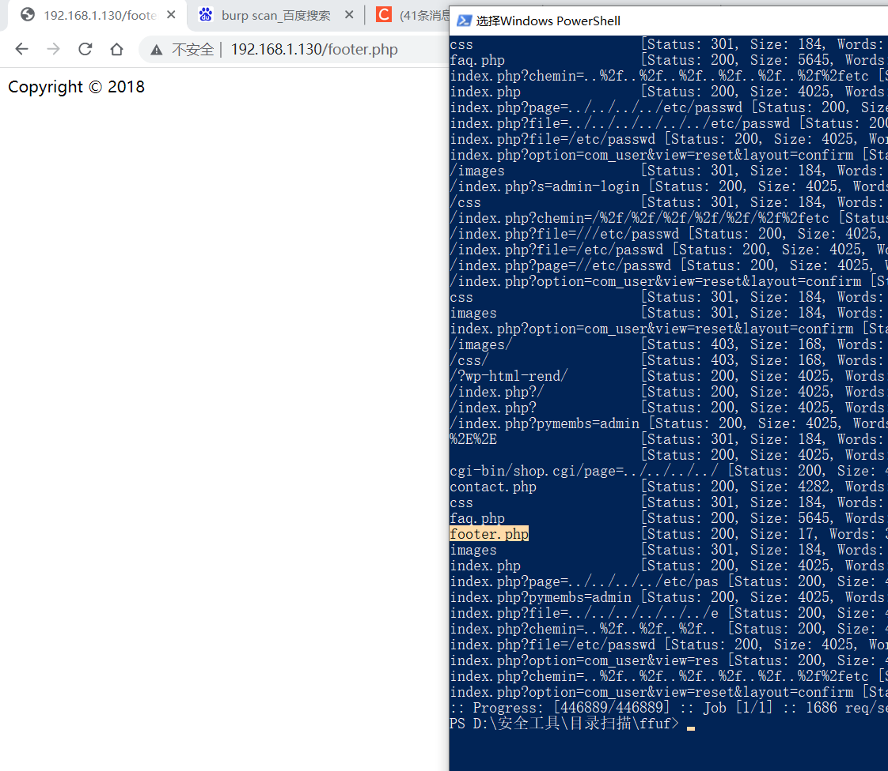
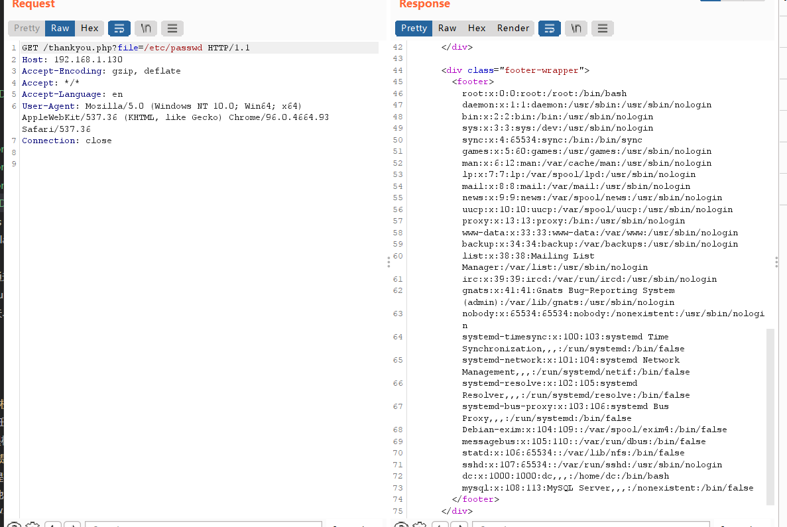
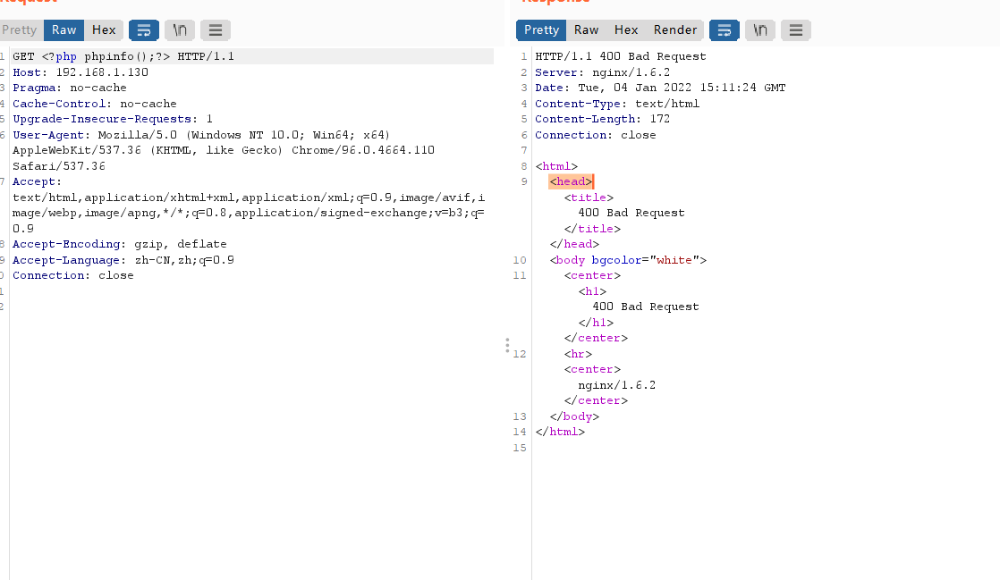

nmap -sP 192.168.1.0/24

或者

arp-scan -l

主机发现

进行详细扫描

nmap -A -p- 192.168.1.130

发现目标主机开启了80,111,54936端口,访问80端口

发现contact，发送之后发现thankyou.php

目录扫描发现footer.php

联想起来发现可能是文件包含漏洞

thankyou.php?file=/etc/passwd

确实存在文件包含漏洞,我们尝试写入一句话木马至日志

写入木马发现报错信息，是nginx，那我们尝试包含nginx的默认日志文件

